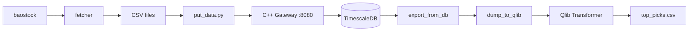

# QuantFrame


End-to-end quantitative trading framework for the China A-share market. Covers daily data ingestion, time-series storage, Transformer-based alpha signal generation (via Qlib), and automated scheduling — backed by a C++ / Drogon REST gateway and TimescaleDB.

> **中文文档**: [docs/README_zh.md](docs/README_zh.md)

## Table of Contents

- [Overview](#overview)
- [Project Structure](#project-structure)
- [Getting Started](#getting-started)
- [Usage](#usage)
- [C++ Data Gateway API](#c-data-gateway-api)
- [Configuration](#configuration)
- [Development Status](#development-status)
- [Changelog](#changelog)
- [License](#license)

## Overview

The system connects four stages into a repeatable daily workflow:

1. **Fetch** — Pull all A-share and index daily bars from baostock (fallback: akshare), save as per-symbol CSVs.
2. **Store** — Batch-POST the CSVs into a C++ REST gateway that upserts rows into a TimescaleDB hypertable.
3. **Transform** — Export from DB, convert to Qlib binary format, compute Alpha158 features.
4. **Predict** — Run a Transformer model (trained with Qlib's rolling-window workflow) to score and rank stocks.

A built-in scheduler (`main.py`) orchestrates these stages on weekdays: an **evening pipeline** (fetch + ingest at 18:15) and an **afternoon pipeline** (export + dump + predict at 14:00). Individual tasks can also be triggered on demand via CLI.



## Project Structure

```
quant/
├── main.py                    # CLI & scheduler entry point
│
├── config/
│   └── settings.py            # Loads .env; exposes data_path, db_host, db_port, tu_token
│
├── data_pipeline/
│   ├── fetcher.py             # StockDataFetcher — baostock/akshare daily bars
│   ├── database.py            # DBClient — HTTP wrapper for the C++ gateway
│   └── preprocesser.py        # TA-Lib feature engineering (RSI, MACD, BBANDS, …)
│
├── alpha_models/
│   ├── qlib_workflow.py       # Qlib TransformerModel + Alpha158, rolling train & backtest
│   ├── quantTransformer.py    # Standalone PyTorch Transformer + trainer
│   └── LSTM.py                # Bidirectional LSTM + attention (external dependency)
│
├── scheduler/
│   └── tasks.py               # @task decorator, individual tasks, pipeline definitions
│
├── scripts/
│   ├── update_data.py         # Incremental fetch for all stocks
│   ├── put_data.py            # Batch-POST CSV directory to gateway
│   ├── dump_bin.py            # CSV → Qlib binary conversion (fire CLI)
│   ├── predict.py             # Load MLflow model, generate top picks
│   ├── filter.py              # Top-500 liquidity filter via DB queries
│   ├── filter_vai_csv.py      # Top-500 liquidity filter via local CSVs
│   ├── export_today.py        # Export single-day data from DB
│   ├── train_alpha_model.py   # Custom Transformer training (draft)
│   └── view.py                # IC/IR & portfolio Plotly reports
│
├── server/
│   ├── main.cc                # Drogon REST API — ingest, query, stats, health
│   ├── CMakeLists.txt         # Build config (Drogon, libpqxx, nlohmann_json)
│   ├── config.json            # Drogon runtime config (listener, DB pool)
│   ├── sql/
│   │   └── market_data_daily.sql  # TimescaleDB hypertable + compression policy
│   └── docker/
│       ├── docker-compose.yml     # TimescaleDB container
│       └── .env.template          # DB credentials template
│
├── news_module/               # News sentiment (early stage)
│   ├── service.py             # Crawl orchestrator
│   ├── schemas.py             # Pydantic models for news items
│   ├── repository.py          # SQLAlchemy CRUD
│   ├── interfaces.py          # Scraper interface definition
│   ├── models.py              # SQLAlchemy ORM model
│   └── scrapers/
│       ├── base.py            # Base scraper with retry + BeautifulSoup
│       └── mock_scraper.py    # Mock scraper for testing
│
├── utils/
│   ├── run_tracker.py         # JSON-based task execution history
│   ├── format.py              # Stock code formatting & date conversion
│   └── io.py                  # CSV / text file helpers
│
├── test/
│   ├── test_run_tracker.py    # Unit tests for run tracker
│   └── test_fetch_data_from_db.py  # Unit tests for DBClient
│
├── backtesting/               # Planned — empty package
├── rl_portfolio/              # Planned — empty package
├── docs/
│   └── tutorials.ipynb        # Tutorial notebook
├── .env.template              # Environment variable template
└── requirements.txt           # Python dependencies
```

## Getting Started

### Prerequisites

| Requirement | Version | Notes |
|-------------|---------|-------|
| Python | >= 3.12 | With conda or venv |
| C++17 compiler | GCC / Clang / MSVC | For the data gateway |
| CMake | >= 3.15 | Gateway build |
| Docker | — | For TimescaleDB |
| TA-Lib C library | — | [Install guide](https://ta-lib.github.io/ta-lib-python/install.html) |

### 1. Install Python dependencies

```bash
git clone <repo-url> && cd quant
pip install -r requirements.txt
```

> `requirements.txt` pins the top-level packages. Transitive deps like `torch`, `pandas`, `requests`, `python-dotenv` are pulled in by `pyqlib`.

### 2. Set environment variables

```bash
cp .env.template .env
```

Edit `.env` and fill in your TuShare token and gateway address:

```
TU_TOKEN = <your-tushare-token>
DB_HOST  = 127.0.0.1
DB_PORT  = 8080
```

### 3. Start TimescaleDB

```bash
cd server/docker
cp .env.template .env   # fill in Postgres credentials
docker compose up -d
```

This creates the `market_data_daily` hypertable with a 7-day compression policy.

### 4. Build and run the C++ data gateway

```bash
cd server
mkdir build && cd build
cmake ..
make -j$(nproc)
cp ../config.json .     # edit DB credentials in config.json
./quantDataBase
```

The gateway listens on `http://0.0.0.0:8080` by default.

## Usage

### Unified CLI (`main.py`)

```bash
# ─── Run a single task ──────────────────────────────
python main.py --run fetch       # Fetch stock & index bars via baostock
python main.py --run ingest      # POST local CSVs to the C++ gateway
python main.py --run export      # Export all symbols from DB to per-symbol CSVs
python main.py --run dump        # Convert CSVs to Qlib binary format
python main.py --run train       # Train Transformer via Qlib workflow
python main.py --run predict     # Generate predictions with latest model

# ─── Run a pipeline ─────────────────────────────────
python main.py --run evening     # fetch → ingest
python main.py --run afternoon   # export → dump → predict
python main.py --run full        # fetch → ingest → dump → train → predict

# ─── Inspect state ──────────────────────────────────
python main.py --status          # Print last run time + metadata for each task

# ─── Daemon mode ────────────────────────────────────
python main.py                   # Start scheduler — weekday cron:
                                 #   18:15 evening pipeline
                                 #   14:00 afternoon pipeline
```

All task runs are logged to `scheduler.log` and persisted to `.data/run_history.json`.

### Standalone scripts

```bash
python scripts/update_data.py              # Fetch all stock history (incremental)
python scripts/put_data.py [data_dir]      # Ingest a CSV directory
python scripts/dump_bin.py dump_all \
  --csv_path=.data/db_export \
  --qlib_dir=.data/qlib_data              # CSV → Qlib binary
python scripts/predict.py                  # Run prediction pipeline
python scripts/filter.py                   # Build top-500 liquidity instrument list
python scripts/view.py                     # Generate Plotly performance reports
```

### Running tests

```bash
python -m pytest test/
```

## C++ Data Gateway API

All endpoints are prefixed with `/api/v1`. The gateway buffers incoming data in a thread-safe queue and flushes to TimescaleDB every 2 seconds via `INSERT … ON CONFLICT DO UPDATE`.

| Method | Endpoint | Description |
|--------|----------|-------------|
| `POST` | `/ingest/daily` | Batch ingest daily bars (JSON array) |
| `POST` | `/ingest/daily/single` | Ingest one daily bar |
| `GET` | `/query/daily/all?date=&limit=&offset=` | All symbols for a date |
| `GET` | `/query/daily/symbol?symbol=&start_date=&end_date=&limit=&offset=` | Single symbol date range |
| `POST` | `/query/daily/symbols` | Multi-symbol query `{"symbols":[], "start_date":"", "end_date":""}` |
| `GET` | `/query/daily/latest?symbol=&n=` | Latest N bars for a symbol |
| `GET` | `/stats/summary?symbol=&start_date=&end_date=` | Aggregated statistics (avg close, total volume, …) |
| `GET` | `/symbols` | List all distinct symbols |
| `DELETE` | `/data/daily?symbol=&start_date=&end_date=` | Delete by symbol and optional date range |
| `GET` | `/health` | Health check (`SELECT 1`) |

## Configuration

### `.env` (project root)

| Variable | Used by | Description |
|----------|---------|-------------|
| `TU_TOKEN` | `config/settings.py` | TuShare API token |
| `DB_HOST` | `config/settings.py` | C++ gateway host (default `127.0.0.1`) |
| `DB_PORT` | `config/settings.py` | C++ gateway port (default `8080`) |
| `DB_USER` | — | Reserved for future use |
| `DB_PASSWORD` | — | Reserved for future use |
| `DB_NAME` | — | Reserved for future use |

### `server/docker/.env` (TimescaleDB)

| Variable | Description | Default |
|----------|-------------|---------|
| `TSDB_HOST` | PostgreSQL host | `127.0.0.1` |
| `TSDB_PORT` | PostgreSQL port | `5432` |
| `TSDB_USER` | PostgreSQL user | `postgres` |
| `TSDB_PASSWORD` | PostgreSQL password | — |
| `TSDB_DB` | Database name | `postgres` |

### `server/config.json`

Drogon configuration: HTTP listener (port 8080), PostgreSQL connection pool, and thread count. The gateway connects to TimescaleDB directly; the Python side only talks to the gateway's HTTP API.

## Development Status

| Module | Status | Notes |
|--------|--------|-------|
| Data fetch (baostock/akshare) | Working | Incremental fetch, retry, ST filtering |
| C++ gateway + TimescaleDB | Working | Upsert, query, stats, Docker deployment |
| Scheduler & CLI | Working | Evening / afternoon pipelines, run history |
| Qlib Transformer workflow | Working | Alpha158, rolling train, MLflow tracking |
| Feature engineering (TA-Lib) | Working | 20+ features, cross-sectional z-score |
| DB HTTP client | Working | Full CRUD, retry on GET |
| Custom QuantTransformer | Implemented | Standalone trainer with early stopping |
| LSTM model | Incomplete | Depends on missing `src.data_loader` |
| News module | Early stage | Mock scraper only; missing `config` module breaks `BaseScraper` import |
| Backtesting | Planned | Empty package; currently relies on Qlib's backtest |
| RL portfolio | Planned | Empty package; `gymnasium` + `stable-baselines3` in deps |
| Tests | Basic | 2 test files covering run tracker and DB client |

## Changelog

### 2026-03-23
- Added scheduler system with `@task` decorator (logging, timing, error handling)
- Added weekday cron pipelines: evening (18:15), afternoon (14:00)
- Added unified CLI entry point (`--run`, `--status`, daemon mode)
- Added `utils/run_tracker.py` for persistent task execution history
- Added `utils/format.py` with stock code and date format utilities
- Added unit tests for run tracker and DB client
- Fixed C++ data gateway bugs

### 2026-03-20
- Updated C++ data gateway server

### 2026-03-19
- Added C++ data gateway (Drogon + TimescaleDB, Docker Compose)
- Added baostock-based data fetcher
- Removed legacy code

### Earlier
- Implemented Qlib Transformer workflow with Alpha158/Alpha360
- Built custom QuantTransformer and LSTM models
- Built data pipeline with akshare fetcher and TA-Lib preprocessor
- Created news sentiment module skeleton
- Added stock filtering and prediction scripts

## License

Not yet specified.
