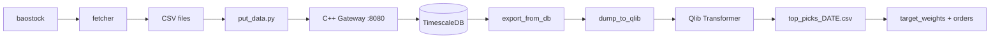

# QuantFrame


End-to-end quantitative trading framework for the China A-share market. Covers daily data ingestion, time-series storage, Transformer-based alpha signal generation (via Qlib), and automated scheduling — backed by a C++ / Drogon REST gateway and TimescaleDB.

> **中文文档**: [docs/README_zh.md](docs/README_zh.md)

## Table of Contents

- [Overview](#overview)
- [Project Structure](#project-structure)
- [Getting Started](#getting-started)
- [Usage](#usage)
- [C++ Data Gateway API](#c-data-gateway-api)
- [Configuration](#configuration)
- [Development Status](#development-status)
- [Changelog](#changelog)
- [License](#license)

## Overview

The system connects four stages into a repeatable daily workflow:

1. **Fetch** — Pull all A-share and index daily bars from baostock (fallback: akshare), save as per-symbol CSVs.
2. **Store** — Batch-POST the CSVs into a C++ REST gateway that upserts rows into a TimescaleDB hypertable.
3. **Transform** — Export from DB, convert to Qlib binary format, and build Alpha158 features.
4. **Modeling** — Train Transformer via Qlib workflow (MLflow tracking + signal/backtest records).
5. **Predict + Execute** — Predict on a dynamic liquidity-based universe, then build target weights and rebalance orders.

A built-in scheduler (`main.py`) orchestrates these stages on weekdays: an **evening pipeline** (fetch + ingest at 18:15) and an **afternoon pipeline** (export + dump + predict + portfolio at 14:00). Individual tasks can also be triggered on demand via CLI.



## Project Structure

| Path | Purpose |
|------|---------|
| `main.py` | Unified CLI and scheduler entry |
| `config/` | Environment and global runtime settings |
| `data_pipeline/` | Fetch / ingest / export market data |
| `alpha_models/` | Qlib training workflow and model configs |
| `scripts/` | Standalone tools (`predict`, `filter`, `dump_bin`, `build_portfolio`, etc.) |
| `scheduler/` | Task wrappers and pipeline orchestration |
| `backtesting/` | Portfolio construction and execution baseline |
| `server/` | C++ Drogon gateway + TimescaleDB deployment assets |
| `test/` | Unit tests |
| `docs/` | Tutorials and supplementary docs |

## Getting Started

### Prerequisites

| Requirement | Version | Notes |
|-------------|---------|-------|
| Python | >= 3.12 | With conda or venv |
| C++17 compiler | GCC / Clang / MSVC | For the data gateway |
| CMake | >= 3.15 | Gateway build |
| Docker | — | For TimescaleDB |
| TA-Lib C library | — | [Install guide](https://ta-lib.github.io/ta-lib-python/install.html) |

### 1. Install Python dependencies

```bash
git clone <repo-url> && cd quant
pip install -r requirements.txt
```

> `requirements.txt` pins the top-level packages. Transitive deps like `torch`, `pandas`, `requests`, `python-dotenv` are pulled in by `pyqlib`.

### 2. Set environment variables

```bash
cp .env.template .env
```

Edit `.env` and fill in your TuShare token and gateway address:

```
TU_TOKEN = <your-tushare-token>
DB_HOST  = 127.0.0.1
DB_PORT  = 8080
```

### 3. Start TimescaleDB

```bash
cd server/docker
cp .env.template .env   # fill in Postgres credentials
docker compose up -d
```

This creates the `market_data_daily` hypertable with a 7-day compression policy.

### 4. Build and run the C++ data gateway

```bash
cd server
mkdir build && cd build
cmake ..
make -j$(nproc)
cp ../config.json .     # edit DB credentials in config.json
./quantDataBase
```

The gateway listens on `http://0.0.0.0:8080` by default.

## Usage

### Unified CLI (`main.py`)

```bash
# ─── Run a single task ──────────────────────────────
python main.py --run fetch       # Fetch stock & index bars via baostock
python main.py --run ingest      # POST local CSVs to the C++ gateway
python main.py --run export      # Export all symbols from DB to per-symbol CSVs
python main.py --run dump        # Convert CSVs to Qlib binary format
python main.py --run train       # Train Transformer via Qlib workflow
python main.py --run predict     # Generate predictions with latest model
python main.py --run portfolio   # Build target weights and rebalance orders

# ─── Run a pipeline ─────────────────────────────────
python main.py --run evening     # fetch → ingest
python main.py --run afternoon   # export → dump → predict → portfolio
python main.py --run full        # fetch → ingest → export → dump → train → predict → portfolio

# ─── Inspect state ──────────────────────────────────
python main.py --status          # Print last run time + metadata for each task

# ─── Daemon mode ────────────────────────────────────
python main.py                   # Start scheduler — weekday cron:
                                 #   18:15 evening pipeline
                                 #   14:00 afternoon pipeline
```

All task runs are logged to `scheduler.log` and persisted to `.data/run_history.json`.

### Standalone scripts

```bash
python -m scripts.update_data                             # Fetch all stock history (incremental)
python -m scripts.put_data [data_dir]                     # Ingest a CSV directory
python scripts/dump_bin.py dump_all --data_path=.data/receive_buffer --qlib_dir=.data/qlib_data
python -m scripts.predict --date 2026-03-25 --out output/top_picks_2026-03-25.csv
python -m scripts.build_portfolio --date 2026-03-25
python -m scripts.eval_test --config alpha_models/workflow_config_transformer_Alpha158.yaml
python -m scripts.filter                                  # Build month-lag liquidity stock pool txt
python -m scripts.view                                    # Generate Plotly performance reports
```

### Running tests

```bash
python -m pytest test/
```

## C++ Data Gateway API

All endpoints are prefixed with `/api/v1`. The gateway buffers incoming data in a thread-safe queue and flushes to TimescaleDB every 2 seconds via `INSERT … ON CONFLICT DO UPDATE`.

| Method | Endpoint | Description |
|--------|----------|-------------|
| `POST` | `/ingest/daily` | Batch ingest daily bars (JSON array) |
| `POST` | `/ingest/daily/single` | Ingest one daily bar |
| `GET` | `/query/daily/all?date=&limit=&offset=` | All symbols for a date |
| `GET` | `/query/daily/symbol?symbol=&start_date=&end_date=&limit=&offset=` | Single symbol date range |
| `POST` | `/query/daily/symbols` | Multi-symbol query `{"symbols":[], "start_date":"", "end_date":""}` |
| `GET` | `/query/daily/latest?symbol=&n=` | Latest N bars for a symbol |
| `GET` | `/stats/summary?symbol=&start_date=&end_date=` | Aggregated statistics (avg close, total volume, …) |
| `GET` | `/symbols` | List all distinct symbols |
| `DELETE` | `/data/daily?symbol=&start_date=&end_date=` | Delete by symbol and optional date range |
| `GET` | `/health` | Health check (`SELECT 1`) |

## Configuration

### `.env` (project root)

| Variable | Used by | Description |
|----------|---------|-------------|
| `TU_TOKEN` | `config/settings.py` | TuShare API token |
| `DB_HOST` | `config/settings.py` | C++ gateway host (default `127.0.0.1`) |
| `DB_PORT` | `config/settings.py` | C++ gateway port (default `8080`) |
| `GATEWAY_LIST_SYMBOLS_TIMEOUT` | `config/settings.py` | Timeout (seconds) for gateway symbol listing |
| `PIPELINE_COOLDOWN_SECONDS` | `scheduler/pipelines.py` | Cooldown between sequential tasks |
| `QLIB_PROVIDER_URI` | Qlib workflow / predict | Qlib data directory |
| `QLIB_MLRUNS_URI` | Qlib workflow | MLflow tracking URI |
| `QLIB_EXPERIMENT_NAME` | Qlib workflow | Experiment name for training runs |
| `QLIB_WORKFLOW_CONFIG` | `alpha_models/qlib_workflow.py` | YAML config path for training |
| `QLIB_EXPERIMENT_ID` | `scripts/predict.py`, `scripts/eval_test.py` | Optional model selector |
| `QLIB_RECORDER_ID` | `scripts/predict.py`, `scripts/eval_test.py` | Optional model selector |
| `QLIB_TORCH_DATALOADER_WORKERS` | workflow runner | Windows DataLoader workers override |
| `DB_USER` | — | Reserved for future use |
| `DB_PASSWORD` | — | Reserved for future use |
| `DB_NAME` | — | Reserved for future use |

### `server/docker/.env` (TimescaleDB)

| Variable | Description | Default |
|----------|-------------|---------|
| `TSDB_HOST` | PostgreSQL host | `127.0.0.1` |
| `TSDB_PORT` | PostgreSQL port | `5432` |
| `TSDB_USER` | PostgreSQL user | `postgres` |
| `TSDB_PASSWORD` | PostgreSQL password | — |
| `TSDB_DB` | Database name | `postgres` |

### `server/config.json`

Drogon configuration: HTTP listener (port 8080), PostgreSQL connection pool, and thread count. The gateway connects to TimescaleDB directly; the Python side only talks to the gateway's HTTP API.

## Development Status

| Module | Status | Notes |
|--------|--------|-------|
| Data fetch (baostock/akshare) | Working | Incremental fetch, retry, ST filtering |
| C++ gateway + TimescaleDB | Working | Upsert, query, stats, Docker deployment |
| Scheduler & CLI | Working | Evening / afternoon / full pipelines, run history |
| Qlib Transformer workflow | Working | Alpha158 config-driven train, MLflow artifact save, signal metrics extraction |
| Predict pipeline | Working | Supports `--date` / `--out`, dynamic 60-day liquidity pool + previous-day expansion to 500 |
| Portfolio execution baseline | Working | Builds target weights and rebalance orders from predictions |
| Test-set evaluation script | Working | `scripts/eval_test.py` computes IC/ICIR on full test segment |
| Feature engineering (TA-Lib) | Working | 20+ features, cross-sectional z-score |
| DB HTTP client | Working | Full CRUD, retry on GET |
| Custom QuantTransformer | Implemented | Standalone trainer with early stopping |
| LSTM model | Incomplete | Depends on missing `src.data_loader` |
| News module | Early stage | Mock scraper only; missing `config` module breaks `BaseScraper` import |
| Liquidity filter script | Working | Month-lag anti-lookahead selection and txt instrument output |
| RL portfolio | Planned | Empty package; `gymnasium` + `stable-baselines3` in deps |
| Tests | Expanded | Includes config, scheduler pipeline, filter, portfolio builder, DB client, ingest/export |

## Changelog

### 2026-04-01
- Excluded ST stocks in training-universe generation (`scripts/filter.py`): month samples sourced from ST periods are now dropped.
- Excluded ST stocks in prediction pool (`scripts/predict.py`) using `$isst`, including previous-day carryover expansion.
- Changed training stock-pool refresh cadence from quarter-lag to month-lag while preserving anti-lookahead behavior.
- Training pool ranking now uses past-quarter liquidity stability; removes top/bottom 5% volatility symbols; keeps 10-group selection with non-uniform top-heavy quotas and per-group minimum coverage.

### 2026-03-31
- Refactored shared pool preprocessing helpers into `utils/preprocess.py` and reused them in both `scripts/filter.py` and `scripts/predict.py`
- Prediction pool now excludes symbols listed in `.data/index_code_list` (including previous-day carryover expansion)
- Aligned prediction Alpha158 label expression with the training workflow label

### 2026-03-26
- Added post-prediction execution step (`portfolio`) into afternoon/full pipelines
- Added `scripts/build_portfolio.py` + `backtesting/portfolio.py` for target weights and rebalance orders
- Upgraded prediction universe logic: 60-day liquidity bucket sampling base pool + previous-day ranked carryover up to 500
- Added flexible prediction/evaluation CLIs (`--date`, `--out`, test-segment evaluation)
- Updated liquidity filter to quarter-lag sampling and txt instrument output to avoid lookahead
- Unified environment variables in `config/settings.py` and expanded `.env.template`

### 2026-03-23
- Added scheduler system with `@task` decorator (logging, timing, error handling)
- Added weekday cron pipelines: evening (18:15), afternoon (14:00)
- Added unified CLI entry point (`--run`, `--status`, daemon mode)
- Added `utils/run_tracker.py` for persistent task execution history
- Added `utils/format.py` with stock code and date format utilities
- Added unit tests for run tracker and DB client
- Fixed C++ data gateway bugs

### 2026-03-20
- Updated C++ data gateway server

### 2026-03-19
- Added C++ data gateway (Drogon + TimescaleDB, Docker Compose)
- Added baostock-based data fetcher
- Removed legacy code

### Earlier
- Implemented Qlib Transformer workflow with Alpha158/Alpha360
- Built custom QuantTransformer and LSTM models
- Built data pipeline with akshare fetcher and TA-Lib preprocessor
- Created news sentiment module skeleton
- Added stock filtering and prediction scripts

## License

This project is licensed under the MIT License. See the [LICENSE](LICENSE) file for details.
