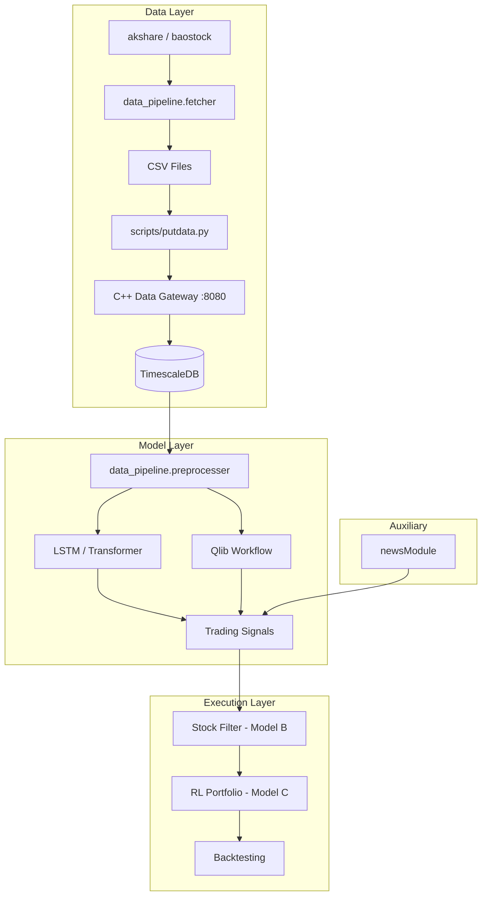
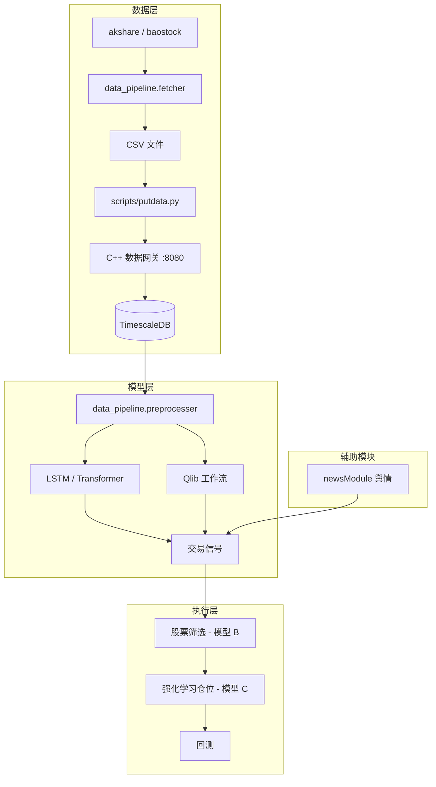

# Quant Trading Framework


> A modular quantitative trading system for China A-shares, integrating deep learning prediction, news sentiment analysis, reinforcement learning portfolio management, and a high-performance C++ data gateway.

## Table of Contents

- [Introduction](#introduction)
- [Features](#features)
- [Quick Start](#quick-start)
- [Architecture](#architecture)
- [API Reference](#api-reference)
- [Configuration](#configuration)
- [Changelog](#changelog)
- [License](#license)

## Introduction

This project is a full-stack quantitative trading framework designed for the China A-share market. It follows a three-model architecture:

- **Model A (The Eye)** — Multi-task LSTM/Transformer for predicting 1-day/5-day returns and 5-day volatility
- **Model B (The Filter)** — Heuristic ranking (e.g., Sharpe ratio) to select the top ~300 tradable stocks
- **Model C (The Hand)** — SAC (Soft Actor-Critic) reinforcement learning agent for portfolio position sizing

The system covers the entire pipeline from data acquisition, feature engineering, model training, signal generation, to backtesting — backed by a high-performance C++ REST API and TimescaleDB for market data storage and retrieval.

## Features

### Implemented

- **Data Pipeline** (`data_pipeline/`)
  - A-share spot and historical K-line data fetching via akshare and baostock
  - ST stock filtering and retry mechanism
  - Feature engineering: log returns, RSI, BIAS, MACD, NATR, Bollinger Bands, volume features, K-line patterns (via TA-Lib)
  - Cross-sectional z-score normalization and correlation analysis
  - HTTP client for the C++ data gateway (ingest, query, stats)

- **Alpha Models** (`alpha_models/`)
  - Bidirectional LSTM with attention mechanism, multi-task heads (1d/5d return, 5d volatility)
  - Transformer-based model (`QuantTransformer`) with learnable positional encoding and early stopping
  - Qlib workflow integration: rolling training (2010–2026), Alpha158/Alpha360 feature sets, TopkDropoutStrategy, IC/IR evaluation

- **News Sentiment Module** (`newsModule/`)
  - Pluggable scraper architecture (base scraper with retry and HTML parsing)
  - SQLAlchemy-based news storage with deduplication
  - Pydantic schemas for news items and crawl results
  - Service layer for crawling, querying, and cleanup

- **C++ Data Gateway** (`server/`)
  - High-performance REST API built with Drogon framework
  - TimescaleDB hypertable with automatic compression (7-day policy)
  - Batch ingest with thread-safe buffer and periodic flush (5s interval)
  - Query endpoints: by date, symbol, multi-symbol, latest N bars, statistical summary
  - Docker Compose deployment for TimescaleDB

- **Scripts & Utilities** (`scripts/`, `utils/`)
  - `update_data.py` — Bulk fetch all stock and index history
  - `putdata.py` — Ingest CSV files into the data gateway
  - `filter.py` — Select top 500 stocks by annual turnover
  - `predict.py` — Load MLflow model, generate top 20 stock picks
  - `view.py` — Generate IC/IR and portfolio HTML reports
  - Stock code formatting and CSV I/O helpers

### In Progress / Planned

- [ ] **Backtesting Module** (`backtesting/`) — Standalone backtesting engine (currently relies on Qlib's built-in backtest)
- [ ] **RL Portfolio Module** (`rl_portfolio/`) — SAC agent for position sizing (dependencies installed, implementation pending)
- [ ] **Real news scrapers** — Production scrapers for Sina Finance, EastMoney, etc. (only mock scraper available)
- [ ] **Test suite** (`test/`) — Unit and integration tests

## Quick Start

### Prerequisites

- Python >= 3.12
- C++17 compiler (GCC / Clang) and CMake >= 3.15
- Docker & Docker Compose
- TA-Lib C library ([installation guide](https://ta-lib.github.io/ta-lib-python/install.html))

### 1. Clone and Install Python Dependencies

```bash
git clone <repo-url> && cd quant
pip install -r requirements.txt
```

### 2. Configure Environment

```bash
cp .env.template .env
# Edit .env with your TuShare token and database credentials
```

### 3. Start TimescaleDB

```bash
cd server/docker
cp .env.template .env
# Edit .env with your database credentials
docker compose up -d
cd ../..
```

### 4. Build & Run the C++ Data Gateway

```bash
cd server
mkdir -p build && cd build
cmake ..
make -j$(nproc)
cp ../config.json .
# Edit config.json with your database credentials
./quantDataBase
```

The server starts at `http://0.0.0.0:8080`.

### 5. Fetch Market Data

```bash
python scripts/update_data.py     # Fetch all stock history (2010–2026)
python scripts/putdata.py         # Ingest CSV data into the gateway
python scripts/filter.py          # Select top 500 liquid stocks
```

### 6. Train & Predict

```bash
python scripts/predict.py         # Run Qlib prediction pipeline
python scripts/view.py            # Generate performance reports
```

## Architecture

```
quant/
├── alpha_models/          # Deep learning prediction models (Model A)
│   ├── LSTM.py            #   Bidirectional LSTM + attention
│   ├── quantTransformer.py#   Transformer model + trainer
│   └── qlib_workflow.py   #   Qlib rolling train/backtest
├── backtesting/           # Backtesting engine (planned)
├── config/                # Central configuration
│   └── settings.py        #   Loads .env, defines Settings
├── data_pipeline/         # Data acquisition & preprocessing
│   ├── fetcher.py         #   akshare/baostock data fetcher
│   ├── database.py        #   HTTP client for C++ gateway
│   └── preprocesser.py    #   Feature engineering (TA-Lib)
├── newsModule/            # News sentiment analysis
│   ├── service.py         #   Crawl orchestrator
│   ├── repository.py      #   SQLAlchemy storage
│   └── scrapers/          #   Pluggable scraper interface
├── rl_portfolio/          # RL position sizing (planned)
├── scripts/               # CLI automation scripts
├── server/                # C++ data gateway
│   ├── main.cc            #   Drogon REST API
│   ├── sql/               #   TimescaleDB schema
│   └── docker/            #   Docker Compose for DB
├── utils/                 # Shared helpers
├── .env.template          # Environment variable template
└── requirements.txt       # Python dependencies
```



## API Reference

The C++ data gateway exposes the following REST endpoints:

| Method | Endpoint | Description |
|--------|----------|-------------|
| `POST` | `/api/v1/ingest/daily` | Batch ingest daily bars (JSON array) |
| `POST` | `/api/v1/ingest/daily/single` | Ingest a single daily bar |
| `GET` | `/api/v1/query/daily/all?date=` | Query all symbols for a given date |
| `GET` | `/api/v1/query/daily/symbol?symbol=&start_date=&end_date=` | Query by symbol and date range |
| `POST` | `/api/v1/query/daily/symbols` | Multi-symbol query (JSON body) |
| `GET` | `/api/v1/query/daily/latest?symbol=&n=` | Get latest N bars for a symbol |
| `GET` | `/api/v1/stats/summary?symbol=&start_date=&end_date=` | Statistical summary |
| `GET` | `/api/v1/symbols` | List all distinct symbols |
| `DELETE` | `/api/v1/data/daily?symbol=&start_date=&end_date=` | Delete data by symbol/date range |
| `GET` | `/api/v1/health` | Health check |

## Configuration

### Root `.env`

| Variable | Description | Default |
|----------|-------------|---------|
| `TU_TOKEN` | TuShare API token | — |
| `DB_HOST` | Database host | `127.0.0.1` |
| `DB_PORT` | Database port | `8080` |
| `DB_USER` | Database username | — |
| `DB_PASSWORD` | Database password | — |
| `DB_NAME` | Database name | — |

### TimescaleDB (`server/docker/.env`)

| Variable | Description | Default |
|----------|-------------|---------|
| `TSDB_HOST` | TimescaleDB host | `127.0.0.1` |
| `TSDB_PORT` | TimescaleDB port | `5432` |
| `TSDB_USER` | PostgreSQL username | `postgres` |
| `TSDB_PASSWORD` | PostgreSQL password | — |
| `TSDB_DB` | Database name | `postgres` |

### C++ Gateway (`server/config.json`)

Drogon configuration file specifying PostgreSQL connection pool, thread count, and listener address/port.

## Changelog

### 2026-03-19
- Added C++ data gateway server (Drogon + TimescaleDB)
- Added new data fetcher based on baostock
- Removed legacy code

### Earlier
- Implemented LSTM and Transformer alpha models
- Integrated Qlib workflow with Alpha158/Alpha360
- Built data pipeline with akshare fetcher and TA-Lib preprocessor
- Created news sentiment module with pluggable scraper architecture
- Added stock filtering and prediction scripts

## License

> License not yet specified.

---

# 量化交易框架


> 一个模块化的中国A股量化交易系统，集成深度学习预测、新闻舆情分析、强化学习仓位管理和高性能 C++ 数据网关。

## 目录

- [简介](#简介)
- [功能特性](#功能特性)
- [快速开始](#快速开始)
- [系统架构](#系统架构)
- [API 参考](#api-参考)
- [配置说明](#配置说明)
- [更新日志](#更新日志)
- [许可证](#许可证)

## 简介

本项目是一个面向中国 A 股市场的全栈量化交易框架，采用三模型架构设计：

- **模型 A（The Eye）** — 多任务 LSTM/Transformer 模型，预测 1 日/5 日收益率和 5 日波动率
- **模型 B（The Filter）** — 启发式排序（如夏普比率），筛选约 300 只可交易股票
- **模型 C（The Hand）** — SAC（Soft Actor-Critic）强化学习智能体，负责仓位管理

系统覆盖从数据获取、特征工程、模型训练、信号生成到回测的完整流程，底层由高性能 C++ REST API 和 TimescaleDB 提供行情数据的存储与查询服务。

## 功能特性

### 已实现

- **数据管道** (`data_pipeline/`)
  - 通过 akshare 和 baostock 获取 A 股实时和历史 K 线数据
  - ST 股票过滤和请求重试机制
  - 特征工程：对数收益率、RSI、BIAS、MACD、NATR、布林带、成交量特征、K 线形态（基于 TA-Lib）
  - 截面 z-score 标准化和相关性分析
  - C++ 数据网关 HTTP 客户端（写入、查询、统计）

- **Alpha 模型** (`alpha_models/`)
  - 双向 LSTM + 注意力机制，多任务预测头（1 日/5 日收益率、5 日波动率）
  - Transformer 模型（`QuantTransformer`），可学习位置编码，支持早停
  - Qlib 工作流集成：滚动训练（2010–2026）、Alpha158/Alpha360 特征集、TopkDropout 策略、IC/IR 评估

- **新闻舆情模块** (`newsModule/`)
  - 可插拔爬虫架构（基础爬虫含重试和 HTML 解析）
  - 基于 SQLAlchemy 的新闻存储，支持去重
  - Pydantic 数据模型（新闻条目、爬取结果）
  - 服务层：爬取、查询和清理

- **C++ 数据网关** (`server/`)
  - 基于 Drogon 框架的高性能 REST API
  - TimescaleDB 超表，自动压缩策略（7 天）
  - 批量写入：线程安全缓冲区 + 定时刷新（5 秒间隔）
  - 查询接口：按日期、按股票代码、多股票查询、最新 N 条、统计摘要
  - Docker Compose 部署 TimescaleDB

- **脚本与工具** (`scripts/`、`utils/`)
  - `update_data.py` — 批量获取全部股票和指数历史数据
  - `putdata.py` — 将 CSV 数据导入数据网关
  - `filter.py` — 按年换手率筛选前 500 只流动性最佳股票
  - `predict.py` — 加载 MLflow 模型，生成 Top 20 选股结果
  - `view.py` — 生成 IC/IR 和组合绩效 HTML 报告
  - 股票代码格式化和 CSV 读写工具

### 开发中 / 计划中

- [ ] **回测模块** (`backtesting/`) — 独立回测引擎（目前依赖 Qlib 内置回测）
- [ ] **强化学习仓位模块** (`rl_portfolio/`) — SAC 仓位管理智能体（依赖已安装，代码待实现）
- [ ] **真实新闻爬虫** — 新浪财经、东方财富等生产环境爬虫（目前仅有 Mock 爬虫）
- [ ] **测试套件** (`test/`) — 单元测试和集成测试

## 快速开始

### 环境要求

- Python >= 3.12
- C++17 编译器（GCC / Clang）和 CMake >= 3.15
- Docker 和 Docker Compose
- TA-Lib C 库（[安装指南](https://ta-lib.github.io/ta-lib-python/install.html)）

### 1. 克隆并安装 Python 依赖

```bash
git clone <repo-url> && cd quant
pip install -r requirements.txt
```

### 2. 配置环境变量

```bash
cp .env.template .env
# 编辑 .env，填入你的 TuShare Token 和数据库凭据
```

### 3. 启动 TimescaleDB

```bash
cd server/docker
cp .env.template .env
# 编辑 .env，填入数据库凭据
docker compose up -d
cd ../..
```

### 4. 编译并运行 C++ 数据网关

```bash
cd server
mkdir -p build && cd build
cmake ..
make -j$(nproc)
cp ../config.json .
# 编辑 config.json，填入数据库凭据
./quantDataBase
```

服务启动于 `http://0.0.0.0:8080`。

### 5. 获取行情数据

```bash
python scripts/update_data.py     # 获取全部股票历史数据（2010–2026）
python scripts/putdata.py         # 将 CSV 数据导入网关
python scripts/filter.py          # 筛选前 500 只高流动性股票
```

### 6. 训练与预测

```bash
python scripts/predict.py         # 运行 Qlib 预测流程
python scripts/view.py            # 生成绩效报告
```

## 系统架构

```
quant/
├── alpha_models/          # 深度学习预测模型（模型 A）
│   ├── LSTM.py            #   双向 LSTM + 注意力机制
│   ├── quantTransformer.py#   Transformer 模型 + 训练器
│   └── qlib_workflow.py   #   Qlib 滚动训练/回测
├── backtesting/           # 回测引擎（计划中）
├── config/                # 中央配置
│   └── settings.py        #   加载 .env，定义 Settings
├── data_pipeline/         # 数据获取与预处理
│   ├── fetcher.py         #   akshare/baostock 数据获取器
│   ├── database.py        #   C++ 网关 HTTP 客户端
│   └── preprocesser.py    #   特征工程（TA-Lib）
├── newsModule/            # 新闻舆情分析
│   ├── service.py         #   爬取调度器
│   ├── repository.py      #   SQLAlchemy 存储
│   └── scrapers/          #   可插拔爬虫接口
├── rl_portfolio/          # 强化学习仓位管理（计划中）
├── scripts/               # CLI 自动化脚本
├── server/                # C++ 数据网关
│   ├── main.cc            #   Drogon REST API
│   ├── sql/               #   TimescaleDB 表结构
│   └── docker/            #   Docker Compose 数据库部署
├── utils/                 # 公共工具
├── .env.template          # 环境变量模板
└── requirements.txt       # Python 依赖
```



## API 参考

C++ 数据网关提供以下 REST 接口：

| 方法 | 端点 | 描述 |
|------|------|------|
| `POST` | `/api/v1/ingest/daily` | 批量写入日线数据（JSON 数组） |
| `POST` | `/api/v1/ingest/daily/single` | 写入单条日线数据 |
| `GET` | `/api/v1/query/daily/all?date=` | 查询指定日期所有股票 |
| `GET` | `/api/v1/query/daily/symbol?symbol=&start_date=&end_date=` | 按股票代码和日期范围查询 |
| `POST` | `/api/v1/query/daily/symbols` | 多股票查询（JSON body） |
| `GET` | `/api/v1/query/daily/latest?symbol=&n=` | 获取指定股票最近 N 条数据 |
| `GET` | `/api/v1/stats/summary?symbol=&start_date=&end_date=` | 统计摘要 |
| `GET` | `/api/v1/symbols` | 列出所有股票代码 |
| `DELETE` | `/api/v1/data/daily?symbol=&start_date=&end_date=` | 按股票代码/日期范围删除数据 |
| `GET` | `/api/v1/health` | 健康检查 |

## 配置说明

### 根目录 `.env`

| 变量 | 描述 | 默认值 |
|------|------|--------|
| `TU_TOKEN` | TuShare API Token | — |
| `DB_HOST` | 数据库主机 | `127.0.0.1` |
| `DB_PORT` | 数据库端口 | `8080` |
| `DB_USER` | 数据库用户名 | — |
| `DB_PASSWORD` | 数据库密码 | — |
| `DB_NAME` | 数据库名 | — |

### TimescaleDB (`server/docker/.env`)

| 变量 | 描述 | 默认值 |
|------|------|--------|
| `TSDB_HOST` | TimescaleDB 主机 | `127.0.0.1` |
| `TSDB_PORT` | TimescaleDB 端口 | `5432` |
| `TSDB_USER` | PostgreSQL 用户名 | `postgres` |
| `TSDB_PASSWORD` | PostgreSQL 密码 | — |
| `TSDB_DB` | 数据库名 | `postgres` |

### C++ 网关 (`server/config.json`)

Drogon 配置文件，指定 PostgreSQL 连接池、线程数和监听地址/端口。

## 更新日志

### 2026-03-19
- 新增 C++ 数据网关服务器（Drogon + TimescaleDB）
- 新增基于 baostock 的数据获取器
- 移除旧代码

### 更早
- 实现 LSTM 和 Transformer Alpha 模型
- 集成 Qlib 工作流（Alpha158/Alpha360）
- 构建数据管道（akshare 获取器 + TA-Lib 预处理器）
- 创建新闻舆情模块（可插拔爬虫架构）
- 新增股票筛选和预测脚本

## 许可证

> 尚未指定许可证。
