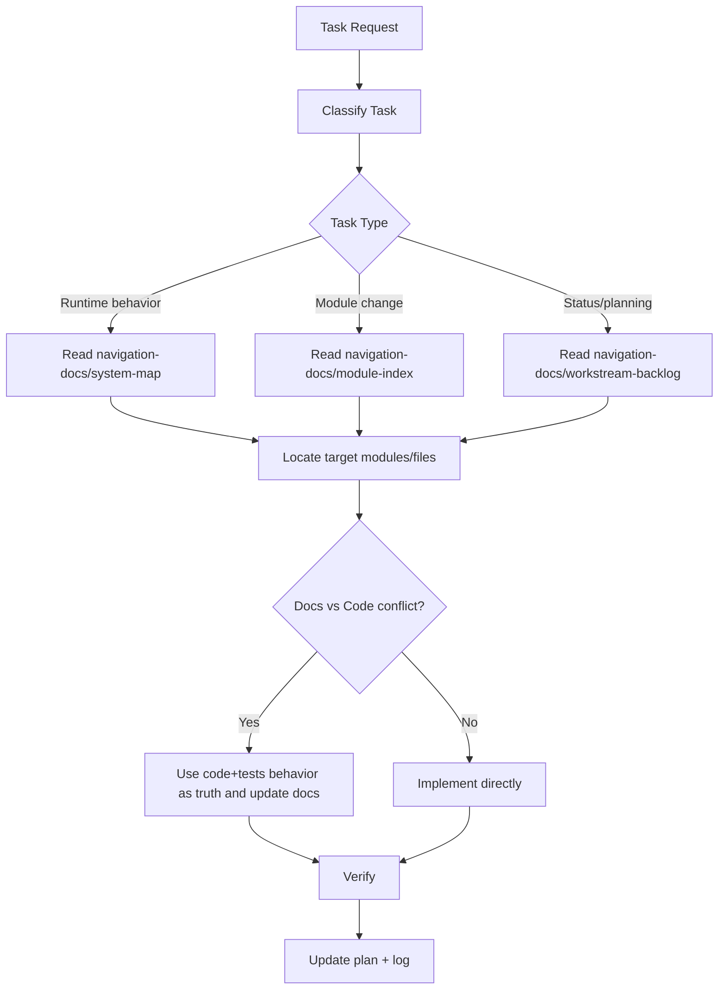

# NAVIGATION

This file defines exactly **how the Navigation rule system runs**.

`docs/navigation-docs/*` is the content layer for module and workstream navigation.

## 1. Inputs and Outputs

Input:
- a task request

Output:
- chosen navigation path
- implementation scope
- verification scope
- trace artifacts (`exec-plan`, `log`)

## 2. Runtime Graph (Rule Execution)

## 3. Execution Procedure (Mandatory)

1. Classify the task type.
2. Read required `navigation-docs` nodes for that type.
3. Identify exact files/modules from the navigation node.
4. If docs conflict with code/tests, trust code/tests behavior and patch docs in same change.
5. Implement smallest reversible change.
6. Run narrowest useful verification, then broader checks as needed.
7. Record trace artifacts (`docs/exec-plans/*`, `docs/logs/*`).

## 4. Priority Order

When reading project docs for implementation:
1. `docs/NAVIGATION.md`
2. `docs/navigation-docs/*`
3. `README.md`, `ARCHITECTURE.md`, `docs/index.md`
4. `docs/design-docs/*`, `docs/product-specs/*`, `docs/exec-plans/active/*`

## 5. Content Layer

Use these files as the active navigation content:
- [System Map](navigation-docs/system-map.md)
- [Module Index](navigation-docs/module-index.md)
- [Workstream Backlog](navigation-docs/workstream-backlog.md)

Chinese version: [docs/NAVIGATION_zh.md](NAVIGATION_zh.md)
