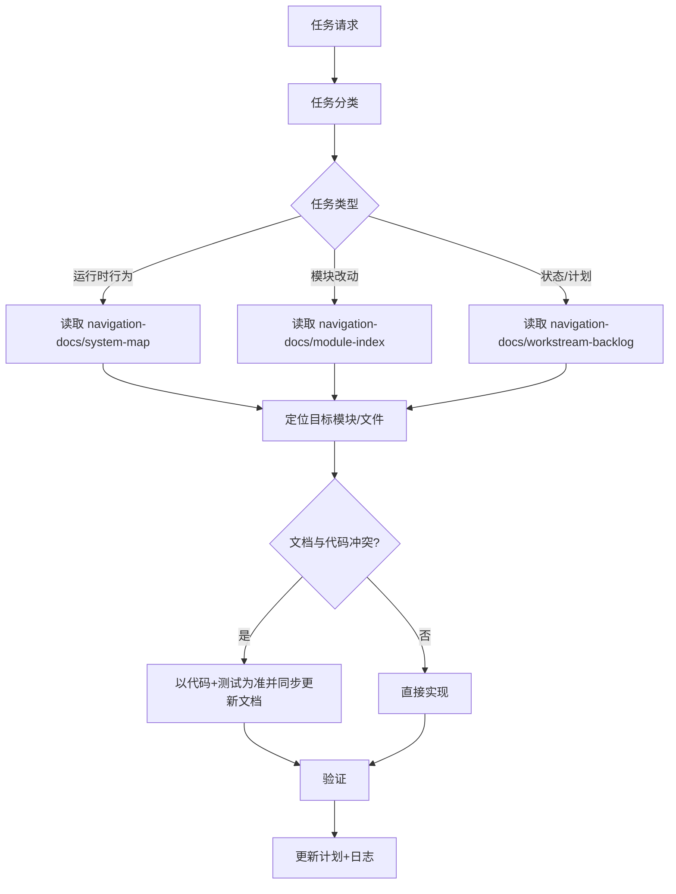

# NAVIGATION

本文档只定义一件事：**Navigation 规则如何运转**。

`docs/navigation-docs/*` 是内容层，用于模块与工作流导航。

## 1. 输入与输出

输入：
- 任务请求

输出：
- 选定的导航路径
- 实施范围
- 验证范围
- 追踪产物（`exec-plan`、`log`）

## 2. 运转图（规则执行图）

## 3. 执行步骤（强制）

1. 先完成任务分类。
2. 读取该类型对应的 `navigation-docs` 节点。
3. 根据导航节点定位到具体模块/文件。
4. 若文档与代码/测试冲突，以代码/测试行为为准，并在同一变更修正文档。
5. 做最小可回滚改动。
6. 先跑最小有效验证，再按需扩大。
7. 更新追踪产物（`docs/exec-plans/*`、`docs/logs/*`）。

## 4. 文档优先级

实现任务时文档优先级：
1. `docs/NAVIGATION.md`
2. `docs/navigation-docs/*`
3. `README.md`、`ARCHITECTURE.md`、`docs/index.md`
4. `docs/design-docs/*`、`docs/product-specs/*`、`docs/exec-plans/active/*`

## 5. 内容层

以下文档即当前导航内容层：
- [系统地图](navigation-docs/system-map_zh.md)
- [模块索引](navigation-docs/module-index_zh.md)
- [工作流待办](navigation-docs/workstream-backlog_zh.md)

英文版：[docs/NAVIGATION.md](NAVIGATION.md)
