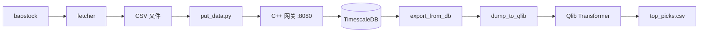

# QuantFrame


面向中国 A 股市场的端到端量化交易框架。覆盖日线数据采集、时序存储、基于 Transformer 的 Alpha 信号生成（通过 Qlib）及自动化调度，底层采用 C++ / Drogon REST 网关 + TimescaleDB。

> **English version**: [README.md](../README.md)

## 目录

- [概述](#概述)
- [项目结构](#项目结构)
- [快速开始](#快速开始)
- [使用方法](#使用方法)
- [C++ 数据网关 API](#c-数据网关-api)
- [配置说明](#配置说明)
- [开发进度](#开发进度)
- [更新日志](#更新日志)
- [许可证](#许可证)

## 概述

系统将四个阶段串联为可重复执行的日常工作流：

1. **采集** — 从 baostock 拉取全 A 股和指数日线数据（备选：akshare），保存为按股票分组的 CSV。
2. **存储** — 将 CSV 批量 POST 到 C++ REST 网关，网关以 upsert 方式写入 TimescaleDB 超表。
3. **转换** — 从数据库导出，转换为 Qlib 二进制格式，计算 Alpha158 特征。
4. **预测** — 运行 Transformer 模型（基于 Qlib 滚动窗口训练），对股票评分排名。

内置调度器（`main.py`）在工作日自动编排：**晚间流水线**（18:15 采集 + 入库）和**午后流水线**（14:00 导出 + 转换 + 预测）。也可通过 CLI 按需触发单个任务。



## 项目结构

```
quant/
├── main.py                    # CLI 与调度器入口
│
├── config/
│   └── settings.py            # 加载 .env；暴露 data_path, db_host, db_port, tu_token
│
├── data_pipeline/
│   ├── fetcher.py             # StockDataFetcher — baostock/akshare 日线采集
│   ├── database.py            # DBClient — C++ 网关 HTTP 封装
│   └── preprocesser.py        # TA-Lib 特征工程（RSI, MACD, BBANDS 等）
│
├── alpha_models/
│   ├── qlib_workflow.py       # Qlib TransformerModel + Alpha158，滚动训练与回测
│   ├── quantTransformer.py    # 独立 PyTorch Transformer + 训练器
│   └── LSTM.py                # 双向 LSTM + 注意力机制（需外部依赖）
│
├── scheduler/
│   └── tasks.py               # @task 装饰器、单任务定义、流水线编排
│
├── scripts/
│   ├── update_data.py         # 增量获取全部股票数据
│   ├── put_data.py            # 批量 POST CSV 目录到网关
│   ├── dump_bin.py            # CSV → Qlib 二进制格式（fire CLI）
│   ├── predict.py             # 加载 MLflow 模型，生成选股结果
│   ├── filter.py              # 通过数据库查询筛选流动性 Top 500
│   ├── filter_vai_csv.py      # 通过本地 CSV 筛选流动性 Top 500
│   ├── export_today.py        # 从数据库导出单日数据
│   ├── train_alpha_model.py   # 自定义 Transformer 训练（草稿）
│   └── view.py                # IC/IR 与组合绩效 Plotly 报告
│
├── server/
│   ├── main.cc                # Drogon REST API — 写入、查询、统计、健康检查
│   ├── CMakeLists.txt         # 构建配置（Drogon, libpqxx, nlohmann_json）
│   ├── config.json            # Drogon 运行配置（监听端口、数据库连接池）
│   ├── sql/
│   │   └── market_data_daily.sql  # TimescaleDB 超表 + 压缩策略
│   └── docker/
│       ├── docker-compose.yml     # TimescaleDB 容器
│       └── .env.template          # 数据库凭据模板
│
├── news_module/               # 新闻舆情（早期阶段）
│   ├── service.py             # 爬取调度器
│   ├── schemas.py             # Pydantic 新闻数据模型
│   ├── repository.py          # SQLAlchemy CRUD
│   ├── interfaces.py          # 爬虫接口定义
│   ├── models.py              # SQLAlchemy ORM 模型
│   └── scrapers/
│       ├── base.py            # 基础爬虫（重试 + BeautifulSoup）
│       └── mock_scraper.py    # 测试用 Mock 爬虫
│
├── utils/
│   ├── run_tracker.py         # 基于 JSON 的任务执行历史
│   ├── format.py              # 股票代码格式化与日期转换
│   └── io.py                  # CSV / 文本文件读写工具
│
├── test/
│   ├── test_run_tracker.py    # run_tracker 单元测试
│   └── test_fetch_data_from_db.py  # DBClient 单元测试
│
├── backtesting/               # 计划中 — 空包
├── rl_portfolio/              # 计划中 — 空包
├── docs/
│   └── tutorials.ipynb        # 教程 Notebook
├── .env.template              # 环境变量模板
└── requirements.txt           # Python 依赖
```

## 快速开始

### 环境要求

| 依赖 | 版本 | 备注 |
|------|------|------|
| Python | >= 3.12 | 推荐 conda 或 venv |
| C++17 编译器 | GCC / Clang / MSVC | 编译数据网关 |
| CMake | >= 3.15 | 网关构建 |
| Docker | — | 用于 TimescaleDB |
| TA-Lib C 库 | — | [安装指南](https://ta-lib.github.io/ta-lib-python/install.html) |

### 1. 安装 Python 依赖

```bash
git clone <repo-url> && cd quant
pip install -r requirements.txt
```

> `requirements.txt` 锁定顶层包版本。`torch`、`pandas`、`requests`、`python-dotenv` 等传递依赖由 `pyqlib` 带入。

### 2. 配置环境变量

```bash
cp .env.template .env
```

编辑 `.env`，填入 TuShare Token 和网关地址：

```
TU_TOKEN = <你的 TuShare Token>
DB_HOST  = 127.0.0.1
DB_PORT  = 8080
```

### 3. 启动 TimescaleDB

```bash
cd server/docker
cp .env.template .env   # 填入 Postgres 凭据
docker compose up -d
```

将创建 `market_data_daily` 超表，并启用 7 天压缩策略。

### 4. 编译并运行 C++ 数据网关

```bash
cd server
mkdir build && cd build
cmake ..
make -j$(nproc)
cp ../config.json .     # 编辑 config.json 中的数据库凭据
./quantDataBase
```

网关默认监听 `http://0.0.0.0:8080`。

## 使用方法

### 统一入口 (`main.py`)

```bash
# ─── 运行单个任务 ────────────────────────────────────
python main.py --run fetch       # 通过 baostock 采集股票和指数日线
python main.py --run ingest      # 将本地 CSV POST 到 C++ 网关
python main.py --run export      # 从数据库导出所有股票到单独 CSV
python main.py --run dump        # 将 CSV 转换为 Qlib 二进制格式
python main.py --run train       # 通过 Qlib 工作流训练 Transformer
python main.py --run predict     # 用最新模型生成预测

# ─── 运行流水线 ──────────────────────────────────────
python main.py --run evening     # fetch → ingest
python main.py --run afternoon   # export → dump → predict
python main.py --run full        # fetch → ingest → dump → train → predict

# ─── 查看状态 ────────────────────────────────────────
python main.py --status          # 打印每个任务的最后运行时间和元数据

# ─── 守护进程模式 ────────────────────────────────────
python main.py                   # 启动调度器 — 工作日定时：
                                 #   18:15 晚间流水线
                                 #   14:00 午后流水线
```

所有任务运行会记录到 `scheduler.log` 并持久化到 `.data/run_history.json`。

### 独立脚本

```bash
python scripts/update_data.py              # 增量获取全部股票历史
python scripts/put_data.py [data_dir]      # 导入 CSV 目录
python scripts/dump_bin.py dump_all \
  --csv_path=.data/db_export \
  --qlib_dir=.data/qlib_data              # CSV → Qlib 二进制
python scripts/predict.py                  # 运行预测流程
python scripts/filter.py                   # 构建流动性 Top 500 股票池
python scripts/view.py                     # 生成 Plotly 绩效报告
```

### 运行测试

```bash
python -m pytest test/
```

## C++ 数据网关 API

所有端点前缀为 `/api/v1`。网关使用线程安全队列缓冲写入数据，每 2 秒通过 `INSERT … ON CONFLICT DO UPDATE` 刷入 TimescaleDB。

| 方法 | 端点 | 说明 |
|------|------|------|
| `POST` | `/ingest/daily` | 批量写入日线数据（JSON 数组） |
| `POST` | `/ingest/daily/single` | 写入单条日线数据 |
| `GET` | `/query/daily/all?date=&limit=&offset=` | 查询指定日期所有股票 |
| `GET` | `/query/daily/symbol?symbol=&start_date=&end_date=&limit=&offset=` | 按股票代码和日期范围查询 |
| `POST` | `/query/daily/symbols` | 多股票查询 `{"symbols":[], "start_date":"", "end_date":""}` |
| `GET` | `/query/daily/latest?symbol=&n=` | 获取指定股票最近 N 条数据 |
| `GET` | `/stats/summary?symbol=&start_date=&end_date=` | 聚合统计（均价、总成交量等） |
| `GET` | `/symbols` | 列出所有股票代码 |
| `DELETE` | `/data/daily?symbol=&start_date=&end_date=` | 按股票代码和可选日期范围删除 |
| `GET` | `/health` | 健康检查（`SELECT 1`） |

## 配置说明

### `.env`（项目根目录）

| 变量 | 读取方 | 说明 |
|------|--------|------|
| `TU_TOKEN` | `config/settings.py` | TuShare API Token |
| `DB_HOST` | `config/settings.py` | C++ 网关主机（默认 `127.0.0.1`） |
| `DB_PORT` | `config/settings.py` | C++ 网关端口（默认 `8080`） |
| `DB_USER` | — | 预留 |
| `DB_PASSWORD` | — | 预留 |
| `DB_NAME` | — | 预留 |

### `server/docker/.env`（TimescaleDB）

| 变量 | 说明 | 默认值 |
|------|------|--------|
| `TSDB_HOST` | PostgreSQL 主机 | `127.0.0.1` |
| `TSDB_PORT` | PostgreSQL 端口 | `5432` |
| `TSDB_USER` | PostgreSQL 用户 | `postgres` |
| `TSDB_PASSWORD` | PostgreSQL 密码 | — |
| `TSDB_DB` | 数据库名 | `postgres` |

### `server/config.json`

Drogon 配置文件：HTTP 监听（8080 端口）、PostgreSQL 连接池和线程数。网关直连 TimescaleDB，Python 端仅与网关的 HTTP API 交互。

## 开发进度

| 模块 | 状态 | 备注 |
|------|------|------|
| 数据采集（baostock/akshare） | 可用 | 增量采集、重试、ST 过滤 |
| C++ 网关 + TimescaleDB | 可用 | Upsert、查询、统计、Docker 部署 |
| 调度器与 CLI | 可用 | 晚间 / 午后流水线、运行历史 |
| Qlib Transformer 工作流 | 可用 | Alpha158、滚动训练、MLflow 跟踪 |
| 特征工程（TA-Lib） | 可用 | 20+ 特征、截面 z-score |
| DB HTTP 客户端 | 可用 | 完整 CRUD、GET 重试 |
| 自定义 QuantTransformer | 已实现 | 独立训练器，支持早停 |
| LSTM 模型 | 未完成 | 依赖缺失的 `src.data_loader` |
| 新闻模块 | 早期阶段 | 仅 Mock 爬虫；`BaseScraper` 缺少 config 模块 |
| 回测 | 计划中 | 空包；目前依赖 Qlib 内置回测 |
| 强化学习组合 | 计划中 | 空包；`gymnasium` + `stable-baselines3` 已在依赖中 |
| 测试 | 基础 | 2 个测试文件，覆盖 run_tracker 和 DB client |

## 更新日志

### 2026-03-23
- 新增调度器系统：`@task` 装饰器（日志、计时、异常处理）
- 新增工作日定时流水线：晚间（18:15）、午后（14:00）
- 新增统一 CLI 入口（`--run`、`--status`、守护进程模式）
- 新增 `utils/run_tracker.py` 任务执行历史持久化
- 新增 `utils/format.py` 股票代码与日期格式化工具
- 新增 run_tracker 和 DBClient 单元测试
- 修复 C++ 数据网关问题

### 2026-03-20
- 更新 C++ 数据网关服务器

### 2026-03-19
- 新增 C++ 数据网关（Drogon + TimescaleDB、Docker Compose）
- 新增基于 baostock 的数据采集器
- 移除历史遗留代码

### 更早
- 实现 Qlib Transformer 工作流（Alpha158/Alpha360）
- 构建自定义 QuantTransformer 和 LSTM 模型
- 构建数据管道（akshare 采集器 + TA-Lib 预处理器）
- 创建新闻舆情模块骨架
- 新增股票筛选和预测脚本

## 许可证

尚未指定。
