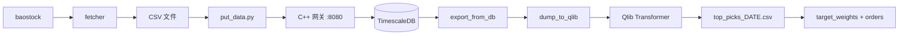

# QuantFrame


面向中国 A 股市场的端到端量化交易框架。覆盖日线数据采集、时序存储、基于 Transformer 的 Alpha 信号生成（通过 Qlib）及自动化调度，底层采用 C++ / Drogon REST 网关 + TimescaleDB。

> **English version**: [README.md](../README.md)

## 目录

- [概述](#概述)
- [项目结构](#项目结构)
- [快速开始](#快速开始)
- [Runtime Guide](#runtime-guide)
- [使用方法](#使用方法)
- [C++ 数据网关 API](#c-数据网关-api)
- [配置说明](#配置说明)
- [开发进度](#开发进度)
- [更新日志](#更新日志)
- [许可证](#许可证)

## 概述

系统将五个阶段串联为可重复执行的日常工作流：

1. **采集** — 从 baostock 拉取全 A 股和指数日线数据，并保存为按股票分组的 CSV。
2. **存储** — 将 CSV 批量 POST 到 C++ REST 网关，网关以 upsert 方式写入 TimescaleDB 超表。
3. **转换** — 从数据库导出并转换为 Qlib 二进制格式，构建 Alpha158 特征。
4. **建模** — 通过 Qlib 工作流训练 Transformer（MLflow 跟踪 + 信号/回测记录）。
5. **预测与执行** — 在确定性的滞后流动性股票池上预测，并结合显式持仓缓冲规则生成目标权重与调仓指令。

内置调度器位于 `main.py`，并通过 runtime registry 在工作日自动编排：**晚间流水线**（18:15 采集 + 入库）和**午后流水线**（14:00 导出 + 转换 + 预测 + 组合执行）。也可通过 CLI 按需触发单个任务。

运行时指南：
- 英文：[docs/python-runtime-guide.md](python-runtime-guide.md)
- 中文：[docs/python-runtime-guide_zh.md](python-runtime-guide_zh.md)



## 项目结构

| 路径 | 作用 |
|------|------|
| `main.py` | 统一 CLI 与调度入口 |
| `runtime/` | 规范运行时编排、配置、runlog、任务注册、services 与 workflow adapters |
| `model_function/` | 模型域复用逻辑：股票池构建、Qlib workflow 装配、recorder/模型访问与分析 helper 的沉淀位置 |
| `data_pipeline/` | 底层 BaoStock 抓取 provider 与 C++ 网关客户端 |
| `alpha_models/` | Qlib 训练工作流与模型配置 |
| `scripts/` | 薄独立 CLI wrapper（`update_data`、`put_data`、`predict`、`dump_bin`、`build_portfolio` 等） |
| `utils/` | 被 runtime 与脚本复用的格式化、IO 与预处理叶子工具 |
| `backtesting/` | 组合构建与执行基线 |
| `server/` | C++ Drogon 网关与 TimescaleDB 部署资源 |
| `test/` | 单元测试 |
| `docs/` | 教程与补充文档 |

当前运行时说明：
- `runtime/` 已是规范控制面，并持有 registry、task、orchestrator、runlog 和 workflow adapter 行为。
- `model_function/` 是当前 Python 侧模型域逻辑的规范归属，承载股票池契约、确定性采样、持仓缓冲，以及共享 Qlib workflow 装配和 recorder/分析 helper 等可复用能力。
- `main.py` 与 `scripts/*` 是面向操作的入口，它们只负责调用 runtime 持有的路径。
- `quantcore/*`、`config/settings.py` 与 `utils/run_tracker.py` 等历史兼容壳已经删除；如需对应能力，请直接使用 `runtime.services`、`runtime.config` 与 `runtime.runlog`。

## 快速开始

### 环境要求

| 依赖 | 版本 | 备注 |
|------|------|------|
| Python | >= 3.12 | 推荐 conda 或 venv |
| C++17 编译器 | GCC / Clang / MSVC | 编译数据网关 |
| CMake | >= 3.15 | 网关构建 |
| Docker | — | 用于 TimescaleDB |
| TA-Lib C 库 | — | [安装指南](https://ta-lib.github.io/ta-lib-python/install.html) |

### 1. 安装 Python 依赖

```bash
git clone <repo-url> && cd quant
pip install -r requirements.txt
```

> `requirements.txt` 锁定顶层包版本。`torch`、`pandas`、`requests`、`python-dotenv` 等传递依赖由 `pyqlib` 带入。

### 2. 配置环境变量

```bash
cp .env.template .env
```

编辑 `.env`，至少填入网关地址：

```
DB_HOST  = 127.0.0.1
DB_PORT  = 8080
```

`TU_TOKEN` 仍保留在 `.env.template` 中，并会被 `runtime.config` 读取，但当前 baostock-only 的抓取路径并不依赖它。

### 3. 启动 TimescaleDB

```bash
cd server/docker
cp .env.template .env   # 填入 Postgres 凭据
docker compose up -d
```

将创建 `market_data_daily` 超表，并启用 7 天压缩策略。

### 4. 编译并运行 C++ 数据网关

```bash
cd server
mkdir build && cd build
cmake ..
make -j$(nproc)
cp ../config.json .     # 编辑 config.json 中的数据库凭据
./quantDataBase
```

网关默认监听 `http://0.0.0.0:8080`。

## Runtime Guide

详见 [docs/python-runtime-guide.md](python-runtime-guide.md)，其中包含规范运行时归属、产物目录说明、任务语义、history 字段和排障说明。

## 使用方法

### 统一入口 (`main.py`)

```bash
# ─── 运行单个任务 ────────────────────────────────────
python main.py --run fetch       # 通过 baostock 采集股票和指数日线
python main.py --run ingest      # 将本地 CSV POST 到 C++ 网关
python main.py --run export      # 从数据库导出所有股票到单独 CSV
python main.py --run dump        # 将 CSV 转换为 Qlib 二进制格式
python main.py --run filter      # 通过 runtime 构建训练股票池 instrument txt
python main.py --run train       # 通过 Qlib 工作流训练 Transformer
python main.py --run predict     # 用最新模型生成预测
python main.py --run portfolio   # 基于预测结果生成目标权重和调仓指令

# ─── 运行流水线 ──────────────────────────────────────
python main.py --run evening     # fetch → ingest
python main.py --run afternoon   # export → dump → predict → portfolio
python main.py --run full        # fetch → ingest → export → dump → train → predict → portfolio

# ─── 查看状态 ────────────────────────────────────────
python main.py --status          # 打印每个任务的最后运行时间和元数据

# ─── 守护进程模式 ────────────────────────────────────
python main.py                   # 启动调度器 — 工作日定时：
                                 #   18:15 晚间流水线
                                 #   14:00 午后流水线
```

所有任务运行会记录到 `scheduler.log`，并通过 runtime runlog store
持久化到 `.data/run_history.json`（仍兼容旧扁平历史文件读取）。

### 独立脚本

```bash
python -m scripts.update_data                             # 增量获取全部股票历史
python -m scripts.put_data --data_dir /path/to/csvs       # 导入 CSV 目录
python -m scripts.dump_bin dump_all --data_path=.data/receive_buffer --qlib_dir=.data/qlib_data
python -m scripts.predict --date 2026-03-25 --out output/top_picks_2026-03-25.csv
python -m scripts.build_portfolio --date 2026-03-25 --buy_rank 300 --hold_rank 500
python -m scripts.eval_test --config alpha_models/workflow_config_transformer_Alpha158.yaml
python -m scripts.filter                                  # 生成按月度滞后规则筛选的确定性训练股票池 txt
python -m scripts.view                                    # 生成 Plotly 绩效报告
```

说明：
- `main.py --run ingest` 以及 `evening` / `full` 流水线会以 `delete_after_ingest=True` 消费打包后的 CSV，因此 ingest attempt 之后会删除已处理文件。
- `scripts.update_data` 现在会显式打印打包后的入库目录（`send_buffer_dir`）。
- `python -m scripts.put_data` 默认是非破坏性的；只有加上 `--delete_after_ingest` 才会在 ingest attempt 之后删除已处理 CSV，包括批次失败的文件。
- `python -m scripts.filter` 现在是共享 `model_function` 训练股票池构建器的一个薄 runtime 包装，同时 `main.py --run filter` 也会通过 runtime registry 调度同一条路径。
- `python -m scripts.predict` 现在对确定性的预测股票池打分：按滞后流动性取前 1000，并把仍处于前 1200 留任带内的已有持仓一起纳入。
- `python -m scripts.build_portfolio` 现在显式暴露 `--buy_rank` 和 `--hold_rank`；默认规则是新买入看前 `300`，已有持仓放宽到前 `500`，再应用最终 `top_k` 容量上限。
- 成功训练后，Qlib workflow 会自动生成 view；如需重跑，仍可手动执行 `python -m scripts.view`。
- 完整股票池契约见：
  - 英文：[docs/product-specs/a-share-universe-contract.md](product-specs/a-share-universe-contract.md)
  - 中文：[docs/product-specs/a-share-universe-contract_zh.md](product-specs/a-share-universe-contract_zh.md)
- 关于原始抓取目录和打包目录的区别，请参考 runtime guide。

### 运行测试

```bash
conda run -n quant python -m unittest discover -s test -p 'test_*.py'
```

## C++ 数据网关 API

所有端点前缀为 `/api/v1`。网关使用线程安全队列缓冲写入数据，每 2 秒通过 `INSERT … ON CONFLICT DO UPDATE` 刷入 TimescaleDB。

| 方法 | 端点 | 说明 |
|------|------|------|
| `POST` | `/ingest/daily` | 批量写入日线数据（JSON 数组） |
| `POST` | `/ingest/daily/single` | 写入单条日线数据 |
| `GET` | `/query/daily/all?date=&limit=&offset=` | 查询指定日期所有股票 |
| `GET` | `/query/daily/symbol?symbol=&start_date=&end_date=&limit=&offset=` | 按股票代码和日期范围查询 |
| `POST` | `/query/daily/symbols` | 多股票查询 `{"symbols":[], "start_date":"", "end_date":""}` |
| `GET` | `/query/daily/latest?symbol=&n=` | 获取指定股票最近 N 条数据 |
| `GET` | `/stats/summary?symbol=&start_date=&end_date=` | 聚合统计（均价、总成交量等） |
| `GET` | `/symbols` | 列出所有股票代码 |
| `DELETE` | `/data/daily?symbol=&start_date=&end_date=` | 按股票代码和可选日期范围删除 |
| `GET` | `/health` | 健康检查（`SELECT 1`） |

## 配置说明

### `.env`（项目根目录）

| 变量 | 读取方 | 说明 |
|------|--------|------|
| `TU_TOKEN` | `runtime.config` | 兼容字段；会被读取到 settings，但当前 baostock 抓取路径不使用 |
| `DB_HOST` | `runtime.config` | C++ 网关主机（默认 `127.0.0.1`） |
| `DB_PORT` | `runtime.config` | C++ 网关端口（默认 `8080`） |
| `GATEWAY_LIST_SYMBOLS_TIMEOUT` | `runtime.config` | 网关股票列表查询超时（秒） |
| `TIMEOUT` | `runtime.config` | 已加载的兼容字段；当前活跃 runtime 路径未直接消费 |
| `PIPELINE_COOLDOWN_SECONDS` | `runtime.config` / `runtime.bootstrap` | 顺序任务之间的冷却时间 |
| `QLIB_MLRUNS_URI` | `runtime.config`、Qlib 工作流 | MLflow 跟踪 URI |
| `QLIB_EXPERIMENT_NAME` | `runtime.config`、Qlib 工作流 | 训练实验名称 |
| `QLIB_WORKFLOW_CONFIG` | `runtime.config`、`alpha_models/qlib_workflow.py` | 训练 YAML 配置路径 |
| `QLIB_EXPERIMENT_ID` | `runtime.config`、预测/评估流程 | 可选模型定位参数 |
| `QLIB_RECORDER_ID` | `runtime.config`、预测/评估流程 | 可选模型定位参数 |
| `QLIB_TORCH_DATALOADER_WORKERS` | `runtime.config` | 已加载的兼容字段；当前 workflow runner 不会直接应用 |

当前代码中 `qlib_provider_uri` 由 `.data/qlib_data` 推导得到，因此不再单独读取 `QLIB_PROVIDER_URI` 环境变量。

### `server/docker/.env`（TimescaleDB）

| 变量 | 说明 | 默认值 |
|------|------|--------|
| `TSDB_HOST` | PostgreSQL 主机 | `127.0.0.1` |
| `TSDB_PORT` | PostgreSQL 端口 | `5432` |
| `TSDB_USER` | PostgreSQL 用户 | `postgres` |
| `TSDB_PASSWORD` | PostgreSQL 密码 | — |
| `TSDB_DB` | 数据库名 | `postgres` |

### `server/config.json`

Drogon 配置文件：HTTP 监听（8080 端口）、PostgreSQL 连接池和线程数。网关直连 TimescaleDB，Python 端仅与网关的 HTTP API 交互。

## 开发进度

| 模块 | 状态 | 备注 |
|------|------|------|
| Runtime 控制面 | 可用 | `main.py` 直接分发到 `runtime.bootstrap`、`runtime.registry`、`runtime.tasks` 与 `runtime.constants` |
| 数据运行时（`fetch` / `ingest` / `export`） | 可用 | 已完成 runtime adapter 切换，窗口计算、批处理、打包、导出归一化和失败报告均由 runtime 持有 |
| C++ 网关 + TimescaleDB | 可用 | Upsert、查询、统计、Docker 部署 |
| 调度器与 CLI | 可用 | 工作日调度逻辑在 `main.py`，脚本保持为 runtime/service 表面之上的薄 wrapper |
| Qlib Transformer 工作流 | 可用 | Alpha158 配置化训练、MLflow 模型落盘、信号指标提取 |
| 预测流程 | 可用 | direct runtime adapter 路径，支持 `--date` / `--out`，使用确定性的滞后流动性入池/留任规则（`1000/1200`）并保留 ST/指数剔除 |
| 组合执行基线 | 可用 | 通过 `runtime.adapters.modeling` 基于预测结果生成目标权重和调仓单，并先应用显式买入/持有带（`300/500`）再做容量裁剪 |
| 测试集评估脚本 | 可用 | `scripts/eval_test.py` 对整段 test 计算 IC/ICIR |
| 特征工程（TA-Lib） | 可用 | 20+ 特征、截面 z-score |
| DB HTTP 客户端 | 可用 | 完整 CRUD、GET 重试 |
| 流动性筛选脚本 | 可用 | 按月度滞后（防未来数据）筛选并输出 txt 股票池 |
| 历史兼容层清理 | 已完成 | 原先的 shim 归属已收口到 `runtime.services`、`runtime.config` 与 `runtime.runlog`；`quantcore/*`、`config/settings.py` 与 `utils/run_tracker.py` 已删除 |
| 强化学习组合 | 计划中 | 目前仅占位包 |
| 测试 | 已扩展 | 重点覆盖 bootstrap、registry、runlog、adapters、CLI wrapper 与 pipeline semantics |

## 更新日志

### 2026-04-02
- 刷新中英文主文档，使其与兼容层清理后的 runtime-first 文件布局保持一致。
- 删除剩余 Python 兼容壳（`quantcore/*`、`config/settings.py`、`utils/run_tracker.py`），并将最后的归属统一到 `runtime.services`、`runtime.config` 与 `runtime.runlog`。
- 更新导航文档与 runtime guide，移除已删除的 scheduler 时代模块路径，并将当前职责统一到 runtime-native 模块。

### 2026-04-01
- 完成 Python runtime overhaul 在模型侧/数据侧的切换：`fetch`、`ingest`、`export`、`dump`、`predict`、`portfolio` 现在都通过 runtime 持有的 adapters 执行，并由薄兼容壳对外暴露。
- 为 fetch / ingest / export 增加结构化结果契约，并补充实用运行时指南（`docs/python-runtime-guide*.md`）。
- 在训练股票池生成（`scripts/filter.py`）中排除 ST：来源月份若含 ST 标记，将不参与后续目标月份入选。
- 在预测股票池（`scripts/predict.py`）中基于 `$isst` 排除 ST，并同步作用于“前一日补池”扩充环节。
- 将训练股票池更新节奏从季度滞后改为月度滞后，同时保持防未来函数约束。
- 训练股票池排序改为基于“过去一个季度流动性稳定性”，并剔除波动率最高/最低各 5%；保留 10 组分层，但采用向高排名倾斜的非均匀配额，且每组保底入选数量。

### 2026-03-31
- 将股票池共有预处理逻辑抽取到 `utils/preprocess.py`，并在 `scripts/filter.py` 与 `scripts/predict.py` 复用
- 预测股票池会排除 `.data/index_code_list` 中的指数代码（包含“前一日结果补池”环节）
- 将预测 Alpha158 标签表达式与训练流程标签表达式对齐

### 2026-03-26
- 在午后/全量流水线中加入 `portfolio` 后处理步骤
- 新增 `scripts/build_portfolio.py` + `backtesting/portfolio.py`，输出目标权重与调仓指令
- 升级预测股票池逻辑：60 日流动性分段抽样基础池 + 前一日高分股票扩充至 500
- 新增可配置预测/评估命令（`--date`、`--out`、整段测试集评估）
- 更新流动性筛选为季度滞后抽样，并输出 txt 股票池格式以规避未来函数
- 在 `config/settings.py` 统一环境变量读取，并补全 `.env.template`

### 2026-03-23
- 新增调度器系统：`@task` 装饰器（日志、计时、异常处理）
- 新增工作日定时流水线：晚间（18:15）、午后（14:00）
- 新增统一 CLI 入口（`--run`、`--status`、守护进程模式）
- 新增 `utils/run_tracker.py` 任务执行历史持久化
- 新增 `utils/format.py` 股票代码与日期格式化工具
- 新增 run_tracker 和 DBClient 单元测试
- 修复 C++ 数据网关问题

### 2026-03-20
- 更新 C++ 数据网关服务器

### 2026-03-19
- 新增 C++ 数据网关（Drogon + TimescaleDB、Docker Compose）
- 新增基于 baostock 的数据采集器
- 移除历史遗留代码

### 更早
- 实现 Qlib Transformer 工作流（Alpha158/Alpha360）
- 构建自定义 QuantTransformer 和 LSTM 模型
- 构建数据管道（akshare 采集器 + TA-Lib 预处理器）
- 创建新闻舆情模块骨架
- 新增股票筛选和预测脚本

## 许可证

本项目采用 MIT License。详情见 [LICENSE](../LICENSE)。
