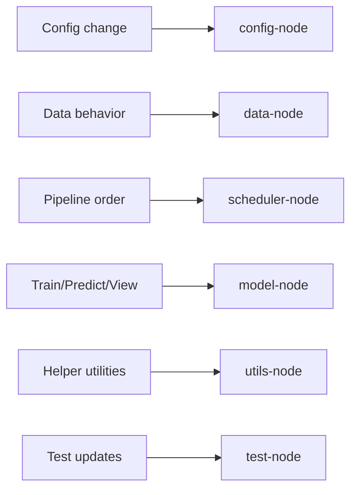

# Navigation Content: Module Index

This file provides module-level navigation nodes.

## 1. Module Nodes and Paths

| Node | Scope | Start here |
|---|---|---|
| `config-node` | env/config behavior | `config/settings.py`, `quantcore/settings.py` |
| `data-node` | data IO and gateway interaction | `data_pipeline/fetcher.py`, `ingest.py`, `database.py` |
| `scheduler-node` | scheduled orchestration | `scheduler/pipelines.py`, `data_tasks.py`, `model_tasks.py` |
| `model-node` | training/predict workflow | `alpha_models/qlib_workflow.py`, `workflow/runner.py`, `scripts/predict.py`, `scripts/view.py` |
| `utils-node` | leaf helper behavior | `utils/io.py`, `utils/format.py`, `utils/run_tracker.py` |
| `test-node` | verification surface | `test/test_*.py` |
| `server-node` | gateway API boundary (read-only for python refactor tasks) | `server/main.cc`, `server/sql/*` |
| `news-node` | deprecated/WIP isolated module | `news_module/*` |

## 2. Module-to-Task Routing Graph

## 3. Notes

- `server-node` and `news-node` stay in navigation for boundary awareness.
- For tasks excluding these nodes, do not implement changes there.
