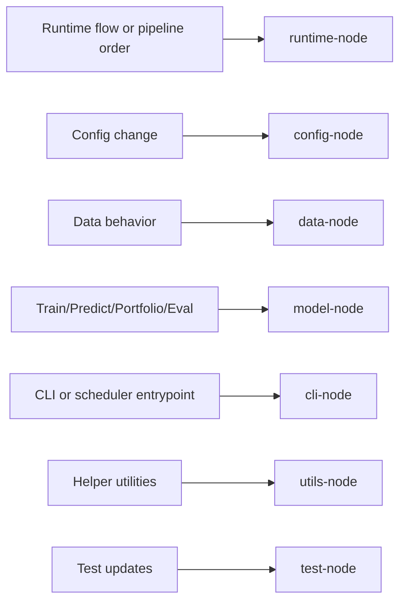

# Navigation Content: Module Index

This file provides module-level navigation nodes for the current repository.

## 1. Module Nodes and Paths

| Node | Scope | Start here |
|---|---|---|
| `runtime-node` | canonical runtime orchestration, task dispatch, and run state | `runtime/bootstrap.py`, `runtime/registry.py`, `runtime/tasks.py`, `runtime/orchestrator.py`, `runtime/runlog.py`, `runtime/constants.py` |
| `config-node` | env/config behavior | `runtime/config.py` |
| `data-node` | data fetch, package, ingest, and export behavior | `runtime/adapters/fetching.py`, `runtime/adapters/ingest.py`, `runtime/adapters/exporting.py`, `runtime/services.py`, `data_pipeline/fetcher.py`, `data_pipeline/database.py` |
| `model-node` | stock-universe, dump, train, predict, portfolio, and model-eval behavior | `model_function/universe.py`, `runtime/adapters/modeling.py`, `runtime/adapters/dump_bin_core.py`, `runtime/services.py`, `alpha_models/qlib_workflow.py`, `alpha_models/workflow/runner.py`, `scripts/filter.py`, `scripts/predict.py`, `scripts/build_portfolio.py`, `scripts/view.py`, `scripts/eval_test.py` |
| `cli-node` | operator-facing entrypoints and script wrappers | `main.py`, `scripts/update_data.py`, `scripts/put_data.py`, `scripts/dump_bin.py`, `scripts/predict.py`, `scripts/build_portfolio.py` |
| `utils-node` | leaf helper behavior | `utils/io.py`, `utils/format.py`, `utils/preprocess.py` |
| `test-node` | verification surface | `test/test_*.py` |
| `server-node` | gateway API boundary (read-only for most Python runtime tasks) | `server/main.cc`, `server/sql/*`, `server/docker/*` |

## 2. Module-to-Task Routing Graph

## 3. Notes

- `runtime-node` is the default entry for current Python runtime work.
- `cli-node` should stay thin; if behavior looks substantial, continue downward into `runtime-node`, `data-node`, or `model-node`.
- Runtime-owned services and adapters are now the only supported starting points for former compatibility-owned behavior.
- Model-domain universe policy now lives in `model_function/universe.py`; use that before duplicating pool or holding-buffer logic inside adapters or scripts.
- For data-side work, start in `runtime/adapters/*` or `runtime/services.py` before touching lower-level providers.
