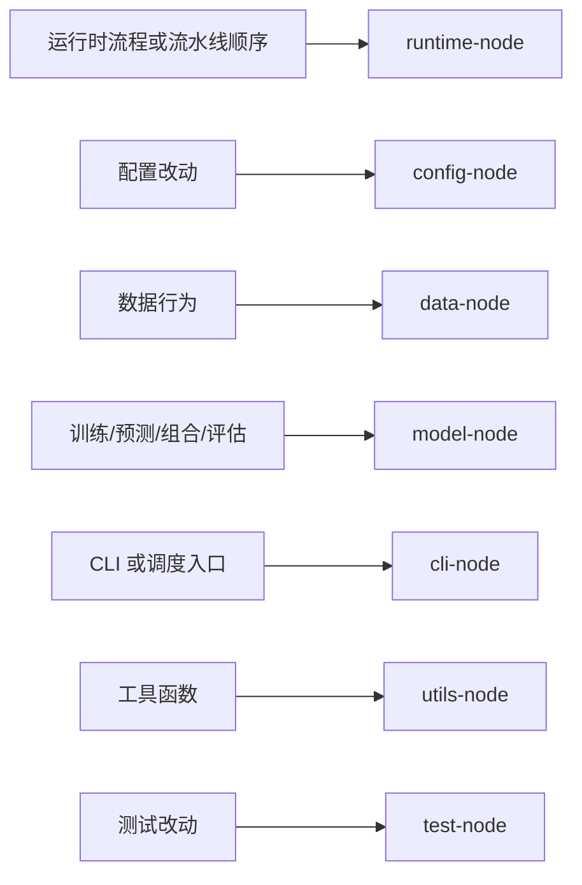

# Navigation 内容层：模块索引

本文件提供当前仓库的模块级导航节点。

## 1. 模块节点与路径

| 节点 | 范围 | 首选入口 |
|---|---|---|
| `runtime-node` | 规范运行时编排、任务分发与运行状态 | `runtime/bootstrap.py`, `runtime/registry.py`, `runtime/tasks.py`, `runtime/orchestrator.py`, `runtime/runlog.py`, `runtime/constants.py` |
| `config-node` | 环境/配置行为 | `runtime/config.py` |
| `data-node` | 数据抓取、打包、入库与导出行为 | `runtime/adapters/fetching.py`, `runtime/adapters/ingest.py`, `runtime/adapters/exporting.py`, `runtime/services.py`, `data_pipeline/fetcher.py`, `data_pipeline/database.py` |
| `model-node` | 股票池、dump、train、predict、portfolio 与模型评估行为 | `model_function/universe.py`, `runtime/adapters/modeling.py`, `runtime/adapters/dump_bin_core.py`, `runtime/services.py`, `alpha_models/qlib_workflow.py`, `alpha_models/workflow/runner.py`, `scripts/filter.py`, `scripts/predict.py`, `scripts/build_portfolio.py`, `scripts/view.py`, `scripts/eval_test.py` |
| `cli-node` | 面向操作的入口与脚本包装 | `main.py`, `scripts/update_data.py`, `scripts/put_data.py`, `scripts/dump_bin.py`, `scripts/predict.py`, `scripts/build_portfolio.py` |
| `utils-node` | 叶子工具行为 | `utils/io.py`, `utils/format.py`, `utils/preprocess.py` |
| `test-node` | 验证面 | `test/test_*.py` |
| `server-node` | 网关 API 边界（大多数 Python runtime 任务只读） | `server/main.cc`, `server/sql/*`, `server/docker/*` |

## 2. 模块到任务路由图

## 3. 说明

- `runtime-node` 是当前 Python 运行时工作的默认入口。
- `cli-node` 应保持足够薄；如果行为较重，应继续下钻到 `runtime-node`、`data-node` 或 `model-node`。
- 曾由兼容层持有的行为现在都应优先从 runtime services/adapters 入手。
- 模型域股票池契约现在统一位于 `model_function/universe.py`；不要在 adapter 或脚本里重复实现池选择或持仓缓冲规则。
- 数据侧任务通常应先从 `runtime/adapters/*` 或 `runtime/services.py` 入手，再考虑底层 provider。
