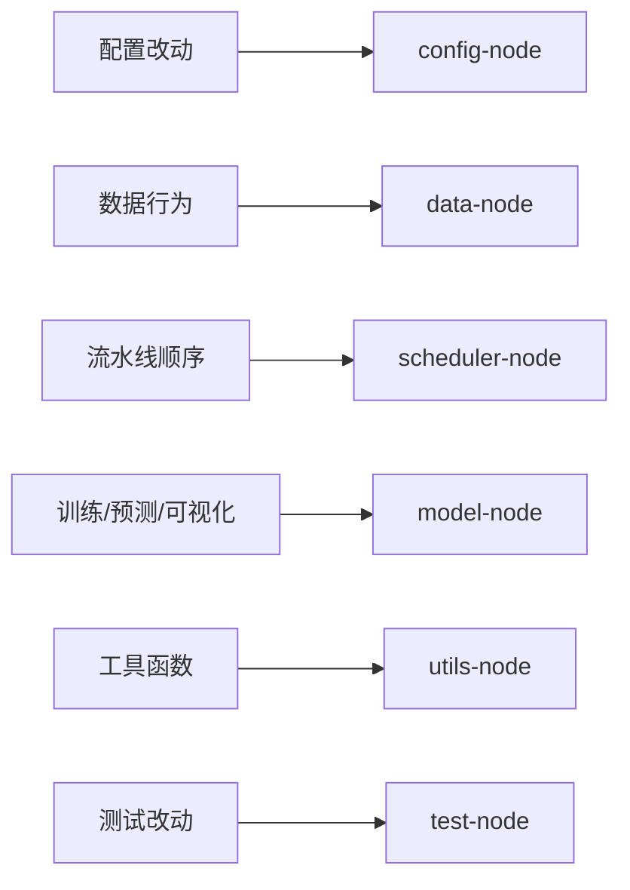

# Navigation 内容层：模块索引

本文件提供模块级导航节点。

## 1. 模块节点与路径

| 节点 | 范围 | 首选入口 |
|---|---|---|
| `config-node` | 环境/配置行为 | `config/settings.py`, `quantcore/settings.py` |
| `data-node` | 数据读写与网关交互 | `data_pipeline/fetcher.py`, `ingest.py`, `database.py` |
| `scheduler-node` | 调度编排 | `scheduler/pipelines.py`, `data_tasks.py`, `model_tasks.py` |
| `model-node` | 训练/预测工作流 | `alpha_models/qlib_workflow.py`, `workflow/runner.py`, `scripts/predict.py`, `scripts/view.py` |
| `utils-node` | 叶子工具行为 | `utils/io.py`, `utils/format.py`, `utils/run_tracker.py` |
| `test-node` | 验证面 | `test/test_*.py` |
| `server-node` | 网关 API 边界（Python 重构任务通常只读） | `server/main.cc`, `server/sql/*` |
| `news-node` | 已弃用/WIP 隔离模块 | `news_module/*` |

## 2. 模块到任务路由图

## 3. 说明

- `server-node` 与 `news-node` 保留在导航中用于边界识别。
- 若任务明确排除这两个节点，不在其中实施改动。
