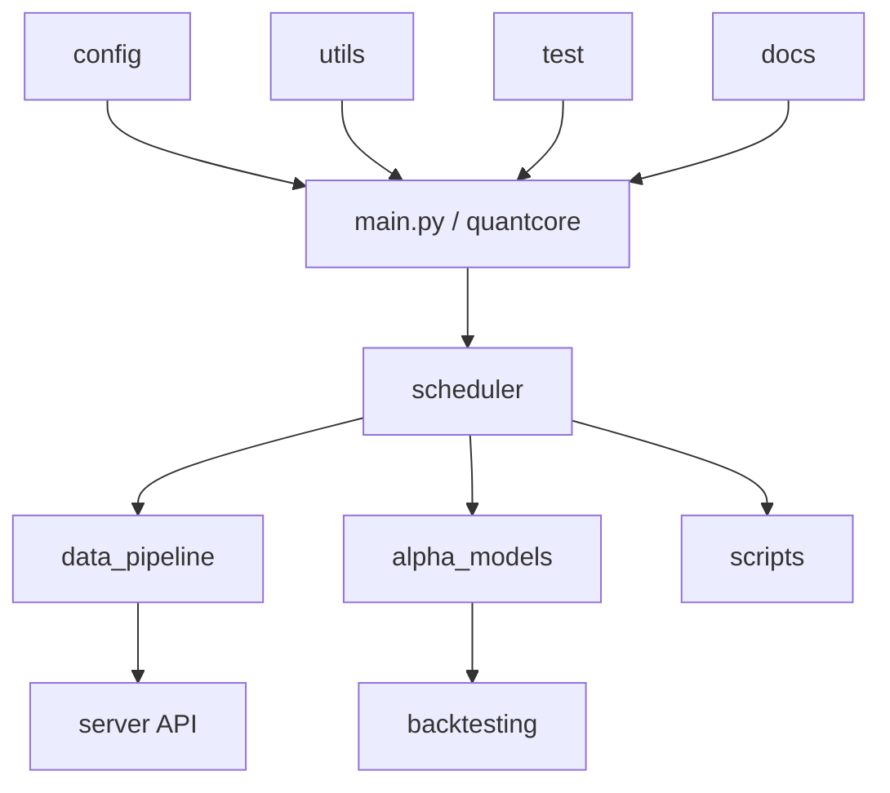

# Navigation Content: System Map

This file provides high-level system topology and module responsibilities.

## 1. Project Topology

## 2. Module Purpose Map

| Module | Purpose | Entry files |
|---|---|---|
| `quantcore/` | runtime core orchestration | `settings.py`, `services/*`, `pipeline.py`, `registry.py` |
| `scheduler/` | scheduled task adapters and pipeline wiring | `data_tasks.py`, `model_tasks.py`, `pipelines.py` |
| `data_pipeline/` | fetch/ingest/export and gateway client | `fetcher.py`, `ingest.py`, `database.py` |
| `alpha_models/` | training workflow and model configs | `qlib_workflow.py`, `workflow/runner.py` |
| `scripts/` | one-off CLI execution paths | `predict.py`, `build_portfolio.py`, `view.py` |
| `config/` | config compatibility and env settings | `settings.py` |
| `utils/` | leaf helpers and run-tracker compatibility | `io.py`, `format.py`, `run_tracker.py` |
| `test/` | unit/integration tests | `test_*.py` |

## 3. Usage

Use this map to identify module ownership before opening detailed module nodes.
