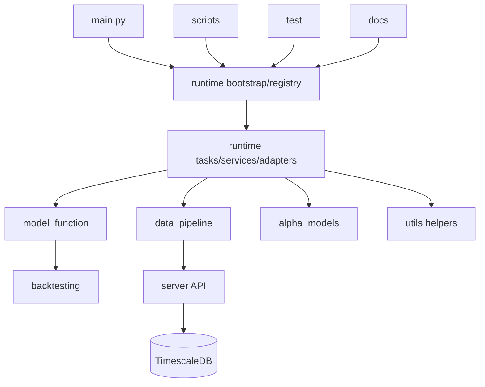

# Navigation Content: System Map

This file provides high-level system topology and module responsibilities for
the current runtime-first repository layout.

## 1. Project Topology

## 2. Module Purpose Map

| Module | Purpose | Entry files |
|---|---|---|
| `runtime/` | canonical orchestration, task registry, runtime state, services, and workflow adapters | `bootstrap.py`, `registry.py`, `tasks.py`, `services.py`, `config.py`, `runlog.py`, `adapters/*` |
| `scripts/` | thin CLI execution paths over runtime or service surfaces | `update_data.py`, `put_data.py`, `dump_bin.py`, `predict.py`, `build_portfolio.py`, `view.py`, `eval_test.py` |
| `model_function/` | reusable model-domain helpers for universe policy, shared Qlib workflow assembly, recorder/model access, and analysis | `universe.py`, `qlib.py` |
| `data_pipeline/` | low-level BaoStock fetch provider and gateway HTTP client | `fetcher.py`, `database.py` |
| `alpha_models/` | Qlib training workflow and workflow runner | `qlib_workflow.py`, `workflow/runner.py` |
| `backtesting/` | portfolio construction and rebalance-order generation | `portfolio.py` |
| `utils/` | shared helper utilities reused by runtime and scripts | `io.py`, `format.py`, `preprocess.py` |
| `test/` | unit and integration-style verification surface | `test_*.py` |
| `server/` | C++ gateway and database deployment assets | `main.cc`, `sql/*`, `docker/*` |

## 3. Usage

Use this map to identify ownership before opening detailed module nodes. For
pipeline dispatch or task ordering, start with `runtime/` rather than looking
for deleted scheduler wrappers.
