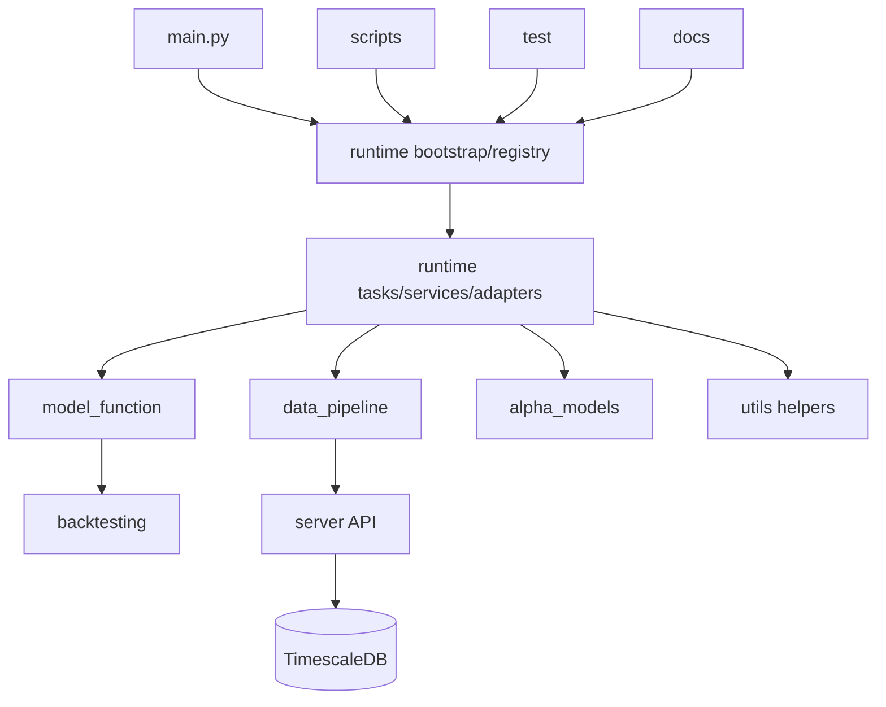

# Navigation 内容层：系统地图

本文件提供当前 runtime-first 仓库布局下的系统级拓扑与模块职责总览。

## 1. 项目拓扑

## 2. 模块用途映射

| 模块 | 作用 | 入口文件 |
|---|---|---|
| `runtime/` | 规范编排、任务注册、运行时状态、services 与 workflow adapters | `bootstrap.py`, `registry.py`, `tasks.py`, `services.py`, `config.py`, `runlog.py`, `adapters/*` |
| `scripts/` | 基于 runtime 或 service 表面的薄 CLI 路径 | `update_data.py`, `put_data.py`, `dump_bin.py`, `predict.py`, `build_portfolio.py`, `view.py`, `eval_test.py` |
| `model_function/` | 股票池规则、共享 Qlib workflow 装配、recorder/模型访问与分析等模型域 helper | `universe.py`, `qlib.py` |
| `data_pipeline/` | 底层 BaoStock 抓取 provider 与网关 HTTP 客户端 | `fetcher.py`, `database.py` |
| `alpha_models/` | Qlib 训练工作流与 workflow runner | `qlib_workflow.py`, `workflow/runner.py` |
| `backtesting/` | 组合构建与调仓订单生成 | `portfolio.py` |
| `utils/` | 被 runtime 与脚本复用的共享工具函数 | `io.py`, `format.py`, `preprocess.py` |
| `test/` | 单元测试与整体流程验证面 | `test_*.py` |
| `server/` | C++ 网关与数据库部署资源 | `main.cc`, `sql/*`, `docker/*` |

## 3. 使用方式

先用本图判断模块归属，再进入具体模块索引节点。凡是涉及流水线分发或任务顺序，都应先从 `runtime/` 入手，而不是去找已经删除的 scheduler wrapper。
