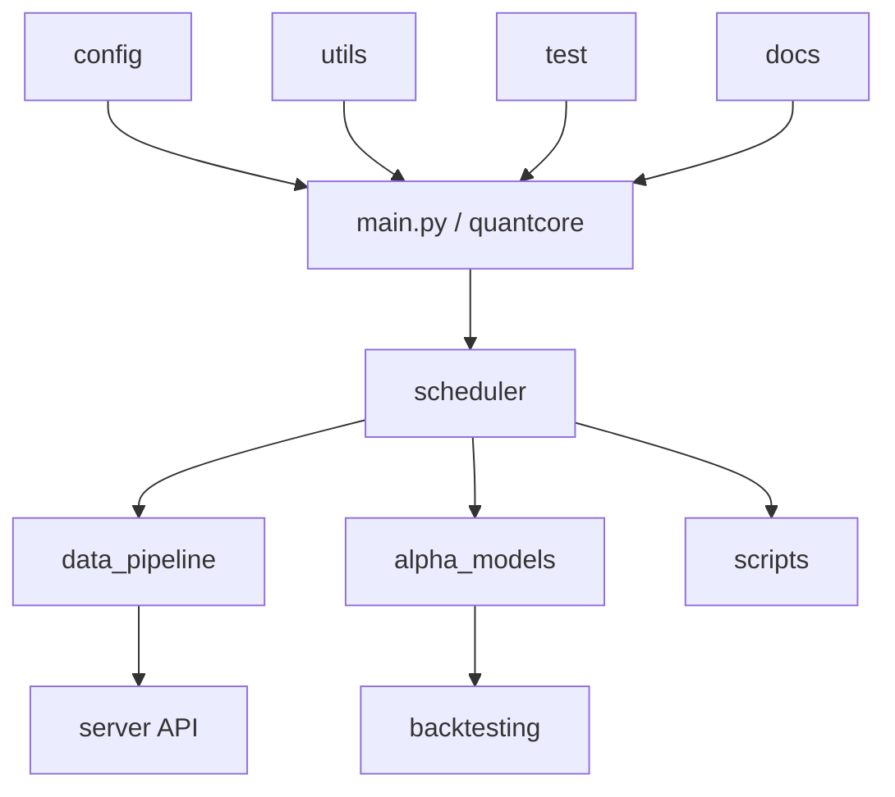

# Navigation 内容层：系统地图

本文件提供系统级拓扑与模块职责总览。

## 1. 项目拓扑

## 2. 模块用途映射

| 模块 | 作用 | 入口文件 |
|---|---|---|
| `quantcore/` | 运行时核心编排 | `settings.py`, `services/*`, `pipeline.py`, `registry.py` |
| `scheduler/` | 调度任务适配与流水线编排 | `data_tasks.py`, `model_tasks.py`, `pipelines.py` |
| `data_pipeline/` | 抓取/入库/导出与网关客户端 | `fetcher.py`, `ingest.py`, `database.py` |
| `alpha_models/` | 训练工作流与模型配置 | `qlib_workflow.py`, `workflow/runner.py` |
| `scripts/` | 一次性 CLI 运行路径 | `predict.py`, `build_portfolio.py`, `view.py` |
| `config/` | 配置兼容入口与环境设置 | `settings.py` |
| `utils/` | 叶子工具与 run-tracker 兼容 | `io.py`, `format.py`, `run_tracker.py` |
| `test/` | 单元/整体测试 | `test_*.py` |

## 3. 使用方式

先使用本图定位模块归属，再进入具体模块索引节点。
